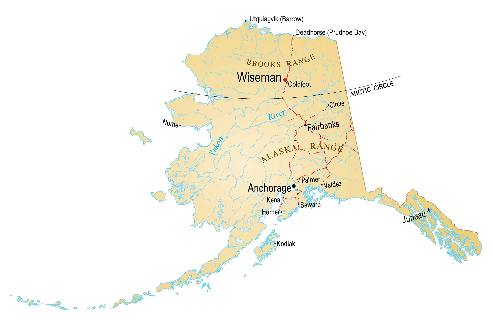

 

Alaska is a U.S. state on the northwest extremity of North America. A semi-exclave of the U.S., it borders British Columbia and the Yukon in Canada to the east, and it shares a western maritime border in the Bering Strait with the Russian Federation's Chukotka Autonomous Okrug.

Capital: Juneau
Area: 665,400 mi²
Population: 732,673 (2021)

 

 

 

 

 
