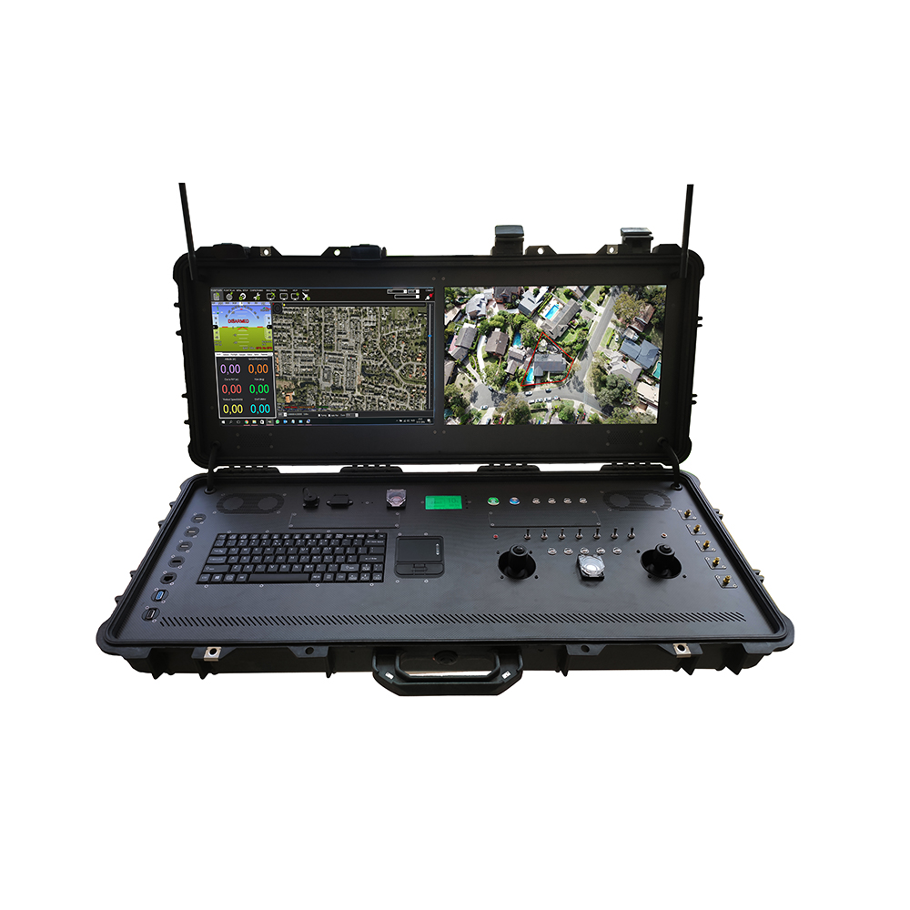
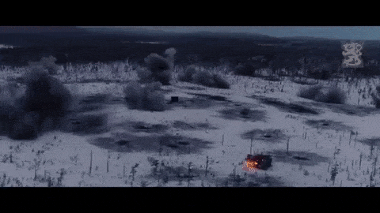

.jpg>)

# Character Description

### Is the person who exercises supreme command and control over armed combat forces. In military operations, a commander bears a greater burden of responsibility than a standard soldier. Such a role demands a high degree of involvement, often requiring the commander to oversee base management for the entirety of the operation. Typically, a commander will only engage in combat if their team is either performing exceedingly well or poorly. Thus, it is imperative that any aspiring commander practice this role in isolation before joining a multiplayer game. A commander's effectiveness has a profound impact on the team's success, and they must be relied upon to lead with skill and strategy.

# Appearance

 

# Special Abilities&#x20;

Commanders will have an array of different assets and strike packages that they can call in.  As resources are gained as you capture them, the Commander will be able to allocate assets to each squads' motor pool or hanger. (armor, vehicles and aircraft)

 

# Fire Support & Air Assets&#x20;

 

1. ISR

1. Artillery&#x20;

1. Smoke Screens

   .jpg>)
2. Airdrop Supplies&#x20;

   
3. Air Strike Packages&#x20;

# Constructable

 

# Disadvantages:

Player will need to have radio man class or one of the vehicles that has the proper radio in order to call in AI air-assets or for manned aircraft assets as well.  Requires the player to have an ultra-high level of multitasking and attention to the progression of the battle, combine with knowing and directing where each of his units and asset are on the map. Game can be won or loss pending the quality of the commander and his knowledge of the tactics.&#x20;
