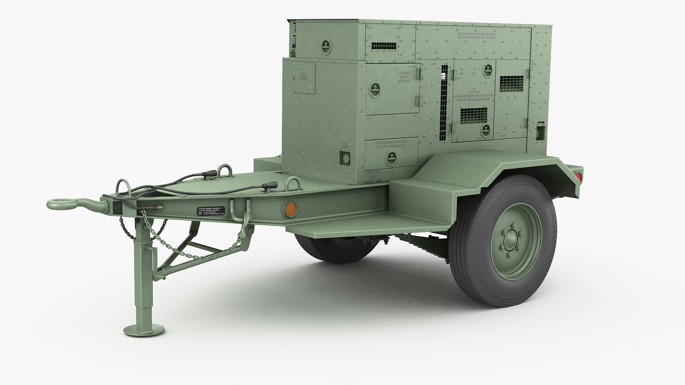

All Construction must have a power grid hooked up. This allows the Commander, Squad Leaders, Engineers and Medics to build a list of  constructable that will help win the battle, ie..  fortifications, defenses objects and other structures.

 

**Power Station -** A power station, also referred to as a power plant and sometimes generating station or generating plant, is an industrial facility for the generation of electric power. Power stations are generally connected to an electrical grid. This station must be built near your Main HQ.

.jpg>)

 

**Mobile Power Station** - The most robust and reliable power solutions for defense or offensive needs. It allows the start of the network grid for the power to be set up to each area captured. This powers your FOB Spawn point and other equipment that requires you to have power grid connected to it.

 

**Comms Tower** - Comms towers will need to be built for each town/ citry in order to complete the capture of the town. Comms towers must be connected to the power grid to complete this task.

 

 

**Forward Operating Base (FOB) -** Static harden spawns' point.

 

**Armory** - a military storage compound where machine guns, rifles, pistols, ammunition, parts, explosives and accessories are kept. **Armory** - loadout menu will be accessed from here for players to buys and build thier kits.

 

**Army** Field **Hospital (MASH) -** Mobile ***Army Surgical*** Hospitals**, is one of two ways where the injuryed players will need to go to in order to heal 100% from a battlefield injury. Medics can only heal a players up to 85% after an injury. These can be built forward by the medics as long a Mobile Medical Vehicle is near by. **

 

**Research Facilities** -research laboratory focused on cutting-edge scientific discovery, technological innovation, and transition of knowledge products that offer incredible potential to improve the military’s chances of surviving and winning any future conflicts. This will be where upgrades of equpment, vehicles and Aircraft is done. This controls the advancement of technology on the battlefield. Once goal and resources have been achieved it will unlock the tech allowing the players to build better vehicles or aircraft  and use better equipment.

 

**Communications Center** -The nerve center or war room is primarily a communications facility where audio, video and digital communication is relayed and analyzed by military staffers who evaluate and correlate various pieces of information to discern the level at which a concern should be elevated. If the communication center is destoryed the VOIP will go down for the team and only Local VOIP will work.&#x20;

 

**HQ -** The military installation from which a commander performs the functions of command.

 

**Hanger** - Storage for air asset assigned to each squad.  Captured vehicles can be salvage or recovered back to the main base to be repaired and reused or cashed out as resources for building different vehicles.  Aircratf can be built there for usage.

 

**Portable Helipad -** Within a minute you can create a stable, permanent or temporary landing zone. It takes one Engineer and commander to install a pad. Here, helicopters operations can be conducted. The pad will be the spawn points for any Rotary Aircraft, rearm, repair and refueling. Please note if the pad is damage in any way the pad will not be able to conduct these fuctions until they have been reapired by an engineer class.

 

**Motor Pool** - Function that is storage for vehicles asset assigned to each squad.  Captured vehicles can be salvage or recovered back to the main base to be repaired and reused or cashed out as resources for building different vehicles.  Vehicles can be built there for usage.

 

 

### Boat Marina : the building that allows players to purchase and utilize small vessels. Commander must place these near a body of water in order for them to function properly.

 

**Rally Spawn Point (RSP)** - Mobile spawn point that can be trip if enemy is near.

 

 

 

 

 

 
