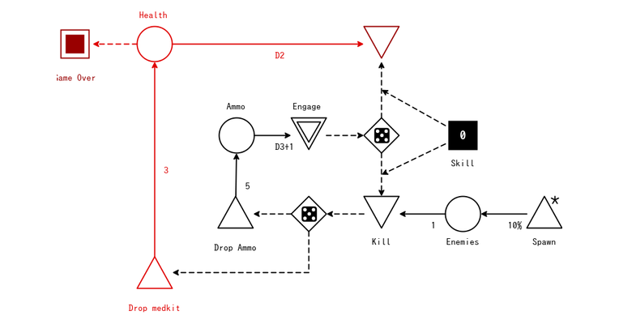

#

Players can gain resources, referred to as supply points, by capturing cities on the map. The acquisition of money is another resource, and can be obtained through killing enemy units, recovery of destroyed assets and capturing cities. Stats will be a large part of added extra income for the players and team.

# Income for captured objectives:&#x20;

The player is entitled to a share of the overall resource income generated, which is initially set at 30% for the player pool. This means that 30% of the total income earned is allocated to the player pool. The resource income is then divided equally among the players and deposited into their budget. For example, if there is one player on a team, they will receive 30% of the total income. However, if there are three players on a team, each of them will receive 10% (30% divided by 3).

 

 

# Income from Stats Tracked

Data Tracked:&#x20;

- Time on Weapon and Type
- Time on Vehicle and Type
- Time on Player Class
- Kills
- Head Shots
- K/D Ratio
- Deaths
- Hours Played
- Wins
- Losses
- Flags/Points Taken
- Total Vehicles Salvage
- Melee Kills
- Vehicles Kills
- Kill strike
- Matches Won
- Hits % or Avg. Accuracy?
- Maps Played
- Hits on Body and Were broken down into 3 tiers?  (( As shown in photo ))

# Stats UI/HUD Layouts Ideas

 
