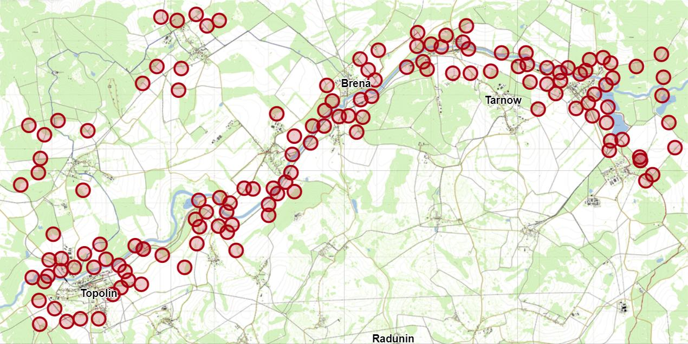
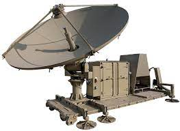
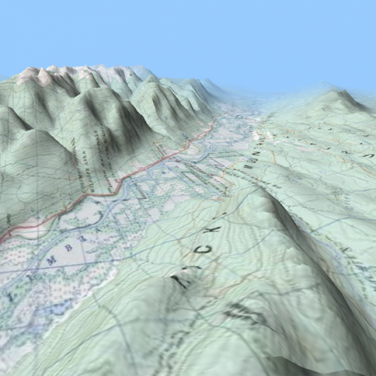

The The Extraction game mode typically involves two teams of players, with one team tasked with extracting a valuable asset or hostage from a designated location, and the other team tasked with preventing the extraction or rescuing the hostage.

In this game mode, there are usually multiple types of extractions that the players can engage in, with each type requiring different tactics and strategies to be successful. For example, some extractions may require the players to escort a VIP to a designated extraction point, while others may involve securing and extracting valuable intel from a hostile location.

To add to the intensity and excitement of the game mode, it is recommended to have a larger player count, such as 32 players, to create a more immersive and challenging experience. Additionally, smaller CQC (close quarters combat) maps can be utilized to make the gameplay more focused and intense, with players forced to engage in close-range combat and strategic maneuvering to achieve their objectives.

Overall, the Extraction game mode can provide a thrilling and dynamic experience for players, challenging their tactical and strategic skills as they work to complete their objectives and outwit their opponents. game mode typically involves two teams of players, with one team tasked with extracting a valuable asset or hostage from a designated location, and the other team tasked with preventing the extraction or rescuing the hostage.

In this game mode, there are usually multiple types of extractions that the players can engage in, with each type requiring different tactics and strategies to be successful. For example, some extractions may require the players to escort a VIP to a designated extraction point, while others may involve securing and extracting valuable intel from a hostile location.

To add to the intensity and excitement of the game mode, it is recommended to have a larger player count, such as 32 players, to create a more immersive and challenging experience. Additionally, smaller CQC (close quarters combat) maps can be utilized to make the gameplay more focused and intense, with players forced to engage in close-range combat and strategic maneuvering to achieve their objectives.

Overall, the Extraction game mode can provide a thrilling and dynamic experience for players, challenging their tactical and strategic skills as they work to complete their objectives and outwit their opponents.

# Dynamic Spawn Points & Objective Generator &#x20;

 

&#x20;Our Dynamic Spawn Points and Objective Generator injects new life into gameplay by removing the ability to exploit the game through prior knowledge of level design. This guarantees a unique experience with every match, keeping the map fresh and allowing players to fully appreciate the thought and detail put into each area of the map by the designers. Elevate your gameplay to the next level with our innovative system.

 

 

# Mapping

 

Transparent Topographical

 

# In Game Comms

Game will have built in VOIP for both local and team that will be tied in with Radio assets to give another layer of immersion. Normal type chat will be allowed for team and all.&#x20;

 

# Elements

 

## Interfaces Design Patterns&#x20;

 

### Badges -&#x20;

 

**Leaderboard -**

 

Levels -&#x20;

 

# Interfaces Design Patterns &#x20;

 

Time constraints -&#x20;

 

Limited Asset Resources -&#x20;

 

Objective Constraints -

 

Resources Systems -&#x20;

 

 

 

 

\
