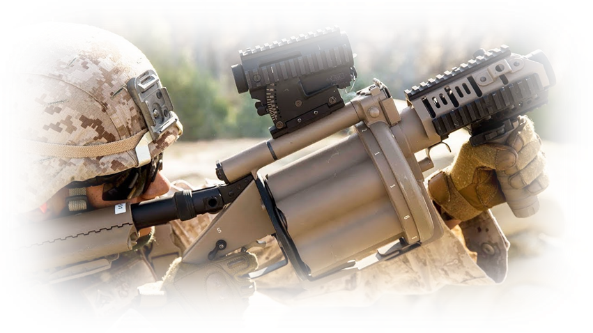

# Character Description

Armed with a grenade launcher, a weapon that fires a specially-designed large-caliber projectile, often with an explosive, smoke or gas warhead. These soldiers operate as part of a fireteam.

# Appearance

# Special Abilities

The grenadier is a key role player for that brings that extra punch to the playing field. His abilities to hit harden or soft targets that may have his unit pinned down with explosive charge of the 40 mm grenades can change the overall outcome of an assault or defense. Players will have the ability to use 3 different types of GL's as the move along.  Some platforms will have a maximum range of 800 meters, exceeding conventional extended range low-velocity variants by up to 375 meters.

# Disadvantages

His weight will be a small obstacle when it comes to disadvantages in-regards to movement on the battlefield. Some weapons platforms will have increase ADS time when firing from the hip or while moving.&#x20;
