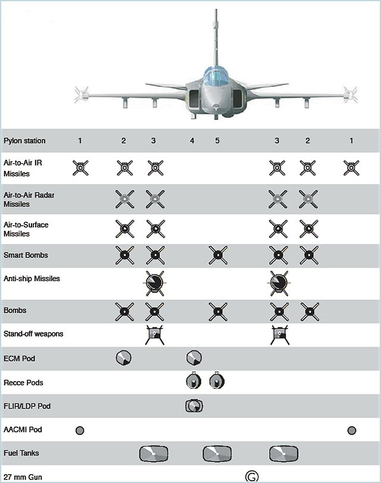
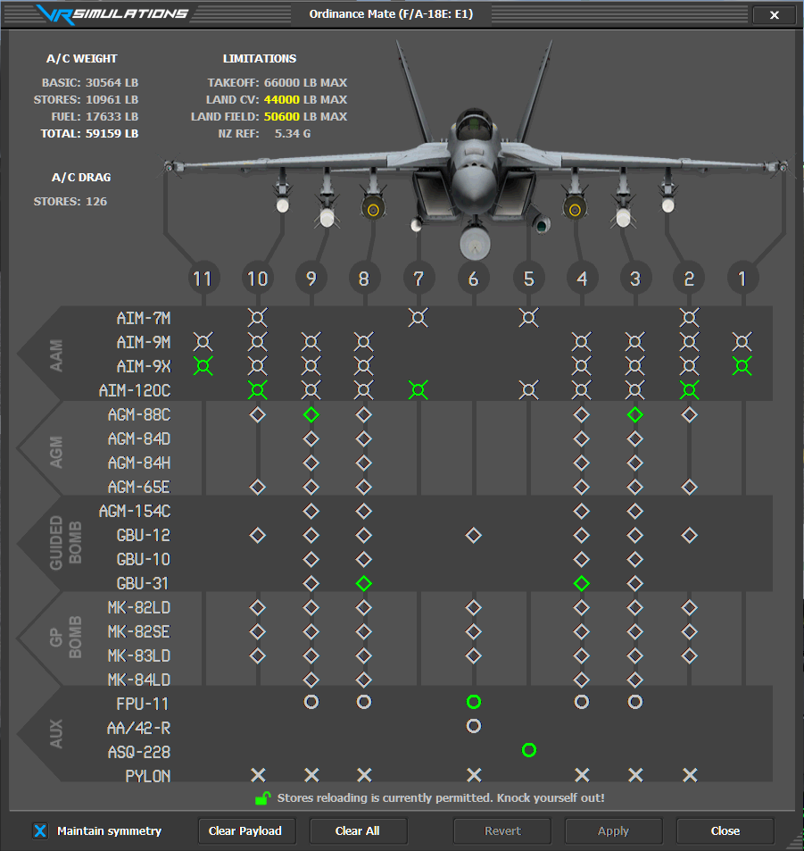

Below are load out and function widgets ideas 💡 &#x20;

 

## Backpack Equipment Inventory&#x20;

Backpack menu will be a radial menu. Each backpack will have its own slot limits.&#x20;

 

## Armory Inventory and Purchase Menu&#x20;

Each player character roll will have their each unique weapons and equipment loadout that they can purchase once unlocked. Every item will have a resources cost to the player.&#x20;

 

## Commander AirStrikes Menu&#x20;

Strike Packages can include other types of aircraft such as helicopters, transport planes and drones .

&#x20;Precision-Guided Munitions (PGMs):

1. &#x20;GBU-24 Paveway iii x 2&#x20;

.jpeg>)

 

2. &#x20;GBU-12 Paveway 500 lbs x 4&#x20;

.jpeg>)

 

3. Mk 82 Snakeyes x 6

 

 

Notes#

Five commonly used explosive weapon systems. These are: the BM-21 122 mm multi barrel rocket launcher (MBRL); 152 mm and 155 mm artillery guns; 81 mm and 82 mm medium mortars and 120 mm heavy mortars; 115 mm, 120 mm and 125 mm tank guns; and the guided and unguided variants of the Mk 82 aircraft bomb.

 

 

## Aircraft Loadout Menu

 

.jpg>)

# Maps  - Compass/GPS&#x20;

Maps and Compass GPS will be set to a hot key for quick access.&#x20;

 

.jpeg>)

.jpeg>)

 

 

 

# Respawn&#x20;

Respawn System will allow players to spawn at different points with times limits:&#x20;

1. &#x20;Main Base
2. &#x20;Each Cap Point
3. &#x20;Rally Points off Squad and Team Leaders&#x20;
    

 

 

 

 

&#x20;
