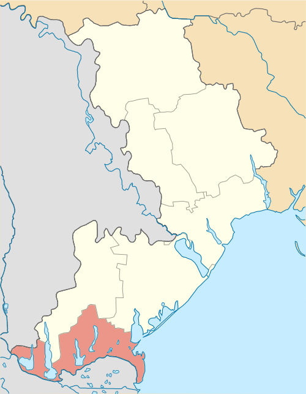

# General description

Izmail is a city and municipality on the Danube river in Odesa Oblast in south-western Ukraine. It serves as the administrative center of Izmail Raion, one of seven districts of Odesa Oblast. Terrain is flat low line area with lakes and wet lands.&#x20;

Area: 20.66 mi²

Elevation: 92′

# Levels that use this area

 

# Connections to other areas

- [Bolhrad, UA](https://app.nuclino.com/Sierra-Zulu-Studios/Game-Design-Document/Bolhrad-UA-4a2cc8fc-2bbc-46d4-a548-d7beb43ef52c "Nuclino")
- [Bilhorod-Dnistrovskyi, Ua](https://app.nuclino.com/Sierra-Zulu-Studios/Game-Design-Document/Bilhorod-Dnistrovskyi-UA-7d83f5ad-3b13-40cb-8137-f456af8a5e91 "Nuclino")

 

 
