# F-15 Eagle&#x20;The McDonnell Douglas F-15 Eagle is an American twin-engine, all-weather tactical fighter aircraft. The Eagle has been exported to Israel, Japan, and Saudi Arabia. The F-15 was originally envisioned as a pure air-superiority aircraft. Its design included a secondary ground-attack capability that was largely unused. The aircraft design proved flexible enough that an improved all-weather strike derivative, the F-15E Strike Eagle, was later developed, entered service in 1989 and has been exported to several nations. # Cockpit There are several F-15 variants have been produced and their cockpits will vary form variants!  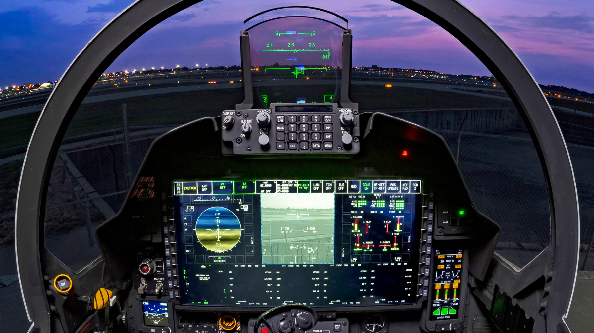
* F-15 Eagle Tactical Fighter| **First flight**  | July 27, 1972                                                                                                                              |
| ----------------- | ------------------------------------------------------------------------------------------------------------------------------------------ |
| **Wingspan**      | 42 feet 10 inches                                                                                                                          |
| **Length**        | 63 feet 9 inches                                                                                                                           |
| **Height**        | 18 feet 8 inches                                                                                                                           |
| **Ceiling**       | 65,000 feet                                                                                                                                |
| **Range**         | 2,400 miles                                                                                                                                |
| **Weight**        | 68,000 pounds                                                                                                                              |
| **Power plant**   | Two 25,000-pound-thrust P\&W F100-PW-100 turbofan engines                                                                                  |
| **Speed**         | 1,875 mph                                                                                                                                  |
| **Accommodation** | F-15A/C, 1 crew; F-15B/D, 2 crew                                                                                                           |
| **Armament**      | AIM-7F/M Sparrow missiles or AIM-120 advanced medium-range air-to-air missiles; AIM-9L/M Sidewinder or AIM-120 missiles; 20 mm Gatling gun | # F-18 HornetF/A-18 Hornet is an all-weather, twin-engine, supersonic, carrier-capable, multirole combat aircraft, designed as both a fighter and attack aircraft (hence the F/A designation).The F/A-18 was designed to be a highly versatile aircraft due to its avionics, cockpit displays, and excellent aerodynamic characteristics, with the ability to carry a wide variety of weapons. The aircraft can perform fighter escort, fleet air defense, suppression of enemy air defenses, air interdiction, close air support, and aerial reconnaissance. Its versatility and reliability have proven it to be a valuable carrier asset.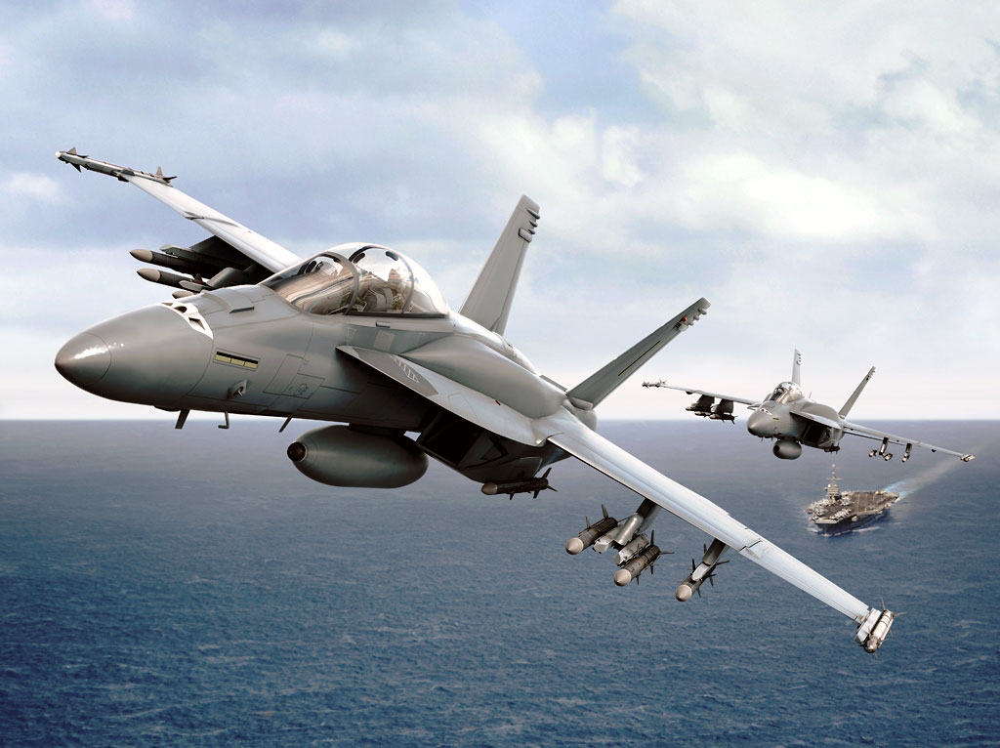# Cockpit * F/A-18 Hornet Fighter| **First flight**   | Nov. 18, 1978                                                                                                                                                          |
| ------------------ | ---------------------------------------------------------------------------------------------------------------------------------------------------------------------- |
| **Wingspan**       | 37 feet 5 inches                                                                                                                                                       |
| **Length**         | 56 feet                                                                                                                                                                |
| **Height**         | 15 feet 3.5 inches                                                                                                                                                     |
| **Takeoff weight** | Fighter, 36,710 pounds; attack, 49,224 pounds                                                                                                                          |
| **Speed**          | 1,360 mph plus                                                                                                                                                         |
| **Ceiling**        | 50,000 feet                                                                                                                                                            |
| **Power plant**    | Two 16,000-pound-thrust GE F404-GE-400 low-bypass turbofan engines                                                                                                     |
| **Accommodation**  | One crew (F/A-18A/C); two crew (F/A-18B/D)                                                                                                                             |
| **Armament**       | One 20 mm M61A1 Vulcan six-barrel cannon with 570 rounds, plus up to 17,000 pounds ordnance, including bombs, rockets, missiles and drop tanks on nine external points | # F-16 Falcon&#x20;F-16 is a single-engine multirole fighter aircraft originally developed. Designed as an air superiority day fighter, it evolved into a successful all-weather multirole aircraft.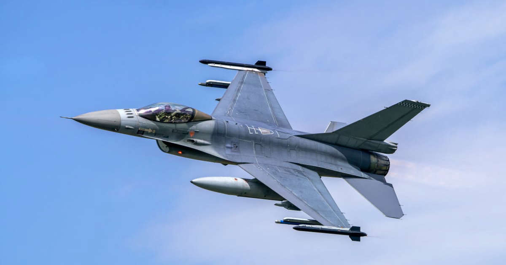 # Cockpit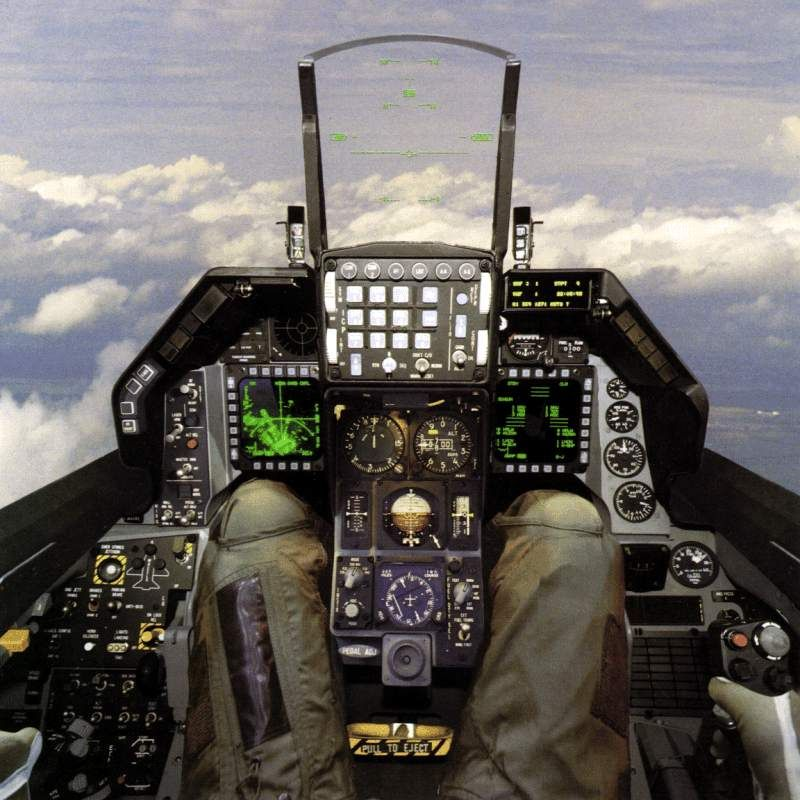* F-16  Multirole Fighter| **First flight**  | 1974                                                                                                                                                                                                                                                                                                                   |
| ----------------- | ---------------------------------------------------------------------------------------------------------------------------------------------------------------------------------------------------------------------------------------------------------------------------------------------------------------------- |
| **Wingspan**      | 32 feet 8 inches                                                                                                                                                                                                                                                                                                       |
| **Length**        | 49 feet 5 inches                                                                                                                                                                                                                                                                                                       |
| **Height**        | 16 feet                                                                                                                                                                                                                                                                                                                |
| **Ceiling**       | 50,000 feet                                                                                                                                                                                                                                                                                                            |
| **Range**         | 2,425 miles                                                                                                                                                                                                                                                                                                            |
| **Weight**        | 37,500 pounds                                                                                                                                                                                                                                                                                                          |
| **Power plant**   | F-16C/D: one Pratt and Whitney F100-PW-200/220/229 or General Electric F110-GE-100/129                                                                                                                                                                                                                                 |
| **Speed**         | 1,500 mph                                                                                                                                                                                                                                                                                                              |
| **Accommodation** | F-16C, one; F-16D, one or two                                                                                                                                                                                                                                                                                          |
| **Armament**      | Two 2,000-pound bombs, two AIM-9, two AIM-120; IM-7F/M Sparrow missiles;and two 2400-pound external fuel tanks; one M-61A1 20mm multibarrel cannon with 500 rounds; external stations can carry up to six air-to-air missiles, conventional air-to-air and air-to-surface munitions and electronic countermeasure pods | # F-22 Raptor&#x20;F-22 Raptor is an American single-seat, twin-engine, all-weather stealth tactical fighter aircraft developed for the United States Air Force. The aircraft was designed as an air superiority fighter, but also has ground attack, electronic warfare, and signals intelligence capabilities.# Cockpit* F-22 Raptor Air Dominance, Multi-Role Fighter| **First Service**   | December 2005                                                                                                                                                                                                                                                                                                                                                    |
| ------------------- | ---------------------------------------------------------------------------------------------------------------------------------------------------------------------------------------------------------------------------------------------------------------------------------------------------------------------------------------------------------------- |
| **Wingspan**        | 44 feet, 6 inches (13.6 meters)                                                                                                                                                                                                                                                                                                                                  |
| **Length**          | 62 feet, 1 inch (18.9 meters                                                                                                                                                                                                                                                                                                                                     |
| **Height**          | 16.67 feet, 5.08 meters                                                                                                                                                                                                                                                                                                                                          |
| **Ceiling**         | Above 50,000 feet                                                                                                                                                                                                                                                                                                                                                |
| **Range**           | 1,200 n.mi / 2,200 km                                                                                                                                                                                                                                                                                                                                            |
| **Weapons Payload** | 18,000 lb / 8,160 kg                                                                                                                                                                                                                                                                                                                                             |
| **Power plant**     | Two Pratt & Whitney F119-PW-100 turbofan engines with afterburners and two-dimensional thrust vectoring nozzles.                                                                                                                                                                                                                                                 |
| **Speed**           | Mach 1.8                                                                                                                                                                                                                                                                                                                                                         |
| **Accommodation**   |  1 crew                                                                                                                                                                                                                                                                                                                                                          |
| **Armament**        | One M61A2 20-millimeter cannon with 480 rounds, internal side weapon bays carriage of two AIM-9 infrared (heat seeking) air-to-air missiles and internal main weapon bays carriage of six AIM-120 radar-guided air-to-air missiles (air-to-air loadout) or two 1,000-pound GBU-32 JDAMs and two AIM-120 radar-guided air-to-air missiles (air-to-ground loadout) | # F-35&#x20;F-35 Lightning II is an American family of single-seat, single-engine, all-weather stealth multirole combat aircraft that is intended to perform both air superiority and strike missions. It is also able to provide electronic warfare and intelligence, surveillance, and reconnaissance capabilities.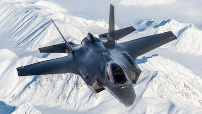 # Cockpit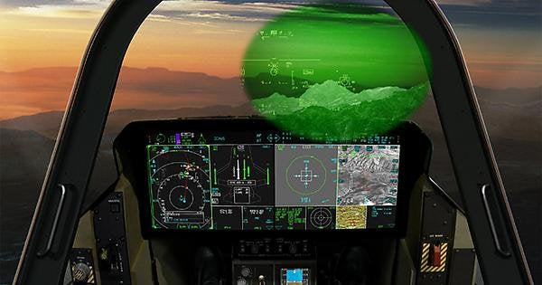* F-35 Multi-Role Fighter| **First flight**    | Dec 2005                                                                                                                                                                                                              |
| ------------------- | --------------------------------------------------------------------------------------------------------------------------------------------------------------------------------------------------------------------- |
| **Wingspan**        | 43 ft / 13.1 m                                                                                                                                                                                                        |
| **Length**          | 51.5 ft / 15.7 m                                                                                                                                                                                                      |
| **Height**          | 14 feet (4.38 meters)                                                                                                                                                                                                 |
| **Ceiling**         | 50,000 feet                                                                                                                                                                                                           |
| **Range**           | 1,200 n.mi / 2,200 km                                                                                                                                                                                                 |
| **Weapons Payload** | 18,000 lb / 8,160 kg                                                                                                                                                                                                  |
| **Power plant**     | One Pratt & Whitney F135-PW-100 turbofan engine                                                                                                                                                                       |
| **Speed**           | Mach 1.6                                                                                                                                                                                                              |
| **Accommodation**   |  1 crew                                                                                                                                                                                                               |
| **Armament**        | F-35A: **one 25 mm GAU-22/A cannon**; standard internal loadout: two AIM-120 AMRAAMs and two GBU-31 JDAMs. The F-35 can carry **up to two AIM-9X missiles on its wings and four AIM-120 AMRAAM missiles internally**. | # &#x20;Su-25 GrachThe Sukhoi Su-25 Grach is a subsonic, single-seat, twin-engine jet aircraft developed in the Soviet Union by Sukhoi. It was designed to provide close air support for Soviet Ground Forces. The first prototype made its maiden flight on 22 February 1975.# Cockpit- Su-25 Grach+-----------------+---------------------------------------------------------------------------------------------------------------------------------------------------------------------------------------------------------------------------------------------+
|**First flight** |1975                                                                                                                                                                                                                                         |
+-----------------+---------------------------------------------------------------------------------------------------------------------------------------------------------------------------------------------------------------------------------------------+
|**Wingspan**     |14.52 m                                                                                                                                                                                                                                      |
+-----------------+---------------------------------------------------------------------------------------------------------------------------------------------------------------------------------------------------------------------------------------------+
|**Length**       |5.20 m                                                                                                                                                                                                                                       |
+-----------------+---------------------------------------------------------------------------------------------------------------------------------------------------------------------------------------------------------------------------------------------+
|**Height**       |6 m                                                                                                                                                                                                                                          |
+-----------------+---------------------------------------------------------------------------------------------------------------------------------------------------------------------------------------------------------------------------------------------+
|**Ceiling**      |7 km                                                                                                                                                                                                                                         |
+-----------------+---------------------------------------------------------------------------------------------------------------------------------------------------------------------------------------------------------------------------------------------+
|**Range**        |1 850 km                                                                                                                                                                                                                                     |
+-----------------+---------------------------------------------------------------------------------------------------------------------------------------------------------------------------------------------------------------------------------------------+
|**Weight**       |19.3 t                                                                                                                                                                                                                                       |
+-----------------+---------------------------------------------------------------------------------------------------------------------------------------------------------------------------------------------------------------------------------------------+
|**Power plant**  |2 x MNPK Soyuz/Gavrilov R-195Sh turbojets                                                                                                                                                                                                    |
+-----------------+---------------------------------------------------------------------------------------------------------------------------------------------------------------------------------------------------------------------------------------------+
|**Speed**        |950 km/h                                                                                                                                                                                                                                     |
+-----------------+---------------------------------------------------------------------------------------------------------------------------------------------------------------------------------------------------------------------------------------------+
|**Accommodation**|1 crew                                                                                                                                                                                                                                       |
+-----------------+---------------------------------------------------------------------------------------------------------------------------------------------------------------------------------------------------------------------------------------------+
|**Armament**     |1 x 30 mm cannon with 200 rounds                                                                                                                                                                                                             |
|                 |                                                                                                                                                                                                                                             |
|                 |Missiles : Vikhr-M anti-tank guided missiles, Kh-29T TV-guided missiles, Kh-25ML and Kh-29L laser-guided missiles, Kh-35 anti-ship missiles, Kh-58U and Kh-35P anti-radar missiles. R-27R, R-77 and R-73 air-to-air missiles for self-defense|
|                 |                                                                                                                                                                                                                                             |
|                 |Bombs: KAB-500Kr laser-guided bombs, KMGU-2 submunitions dispensers, 250- and 500 kg cluster bombs and 50- to 500 kg FAB series free fall bombs                                                                                              |
|                 |                                                                                                                                                                                                                                             |
|                 |Other: pods with unguided rockets                                                                                                                                                                                                            |
+-----------------+---------------------------------------------------------------------------------------------------------------------------------------------------------------------------------------------------------------------------------------------+ # SU-27 Flanker&#x20;Flanker is a Soviet-origin twin-engine supermaneuverable fighter aircraft designed by Sukhoi. It was intended as a direct competitor for the large US fourth-generation jet fighters such as the Grumman F-14 Tomcat and McDonnell Douglas F-15 Eagle, with 3,530-kilometre (1,910 nmi) range, heavy aircraft ordnance, sophisticated avionics and high maneuverability. The Su-27 was designed for air superiority missions, and subsequent variants are able to perform almost all aerial warfare operations. # Cockpit* SU-27 Flanker| **First flight**  | December 1984                                                                                                                                           |
| ----------------- | ------------------------------------------------------------------------------------------------------------------------------------------------------- |
| **Wingspan**      | 14.70 m                                                                                                                                                 |
| **Length**        | 21.93 m                                                                                                                                                 |
| **Height**        | 5.93 m                                                                                                                                                  |
| **Ceiling**       | 72,000 feet                                                                                                                                             |
| **Range**         | 2,193 mi                                                                                                                                                |
| **Weight**        | 30,000 kg                                                                                                                                               |
| **Power plant**   | Turbofan, Saturn AL-31 2 \* 12500 kg Lyulka AL-31F                                                                                                      |
| **Speed**         | Mach 2.35                                                                                                                                               |
| **Accommodation** |  1 crew                                                                                                                                                 |
| **Armament**      | One GSh-30-1 30 mm cannon with 150 rounds, plus 13,228 lb including AAMs, AGMs, bombs, rockets, drop tanks, and ECM pods carried on ten external points | # Su-30 SukhoiSu-30 is a twin-engine, two-seat supermaneuverable (SM) fighter aircraft developed in the Soviet Union by Russia's Sukhoi Aviation Corporation. It is a multirole fighter for all-weather, air-to-air and air interdiction missions. # Cockpit- Su-30 Sukhoi+-----------------+----------------------------------------------------------------------------------------------------------------------------------------------------------------------------------------------------------------+
|**First flight** |1985                                                                                                                                                                                                            |
+-----------------+----------------------------------------------------------------------------------------------------------------------------------------------------------------------------------------------------------------+
|**Wingspan**     |14.7 m (48.2 ft)                                                                                                                                                                                                |
+-----------------+----------------------------------------------------------------------------------------------------------------------------------------------------------------------------------------------------------------+
|**Length**       |21.935 m (72.97 ft)                                                                                                                                                                                             |
+-----------------+----------------------------------------------------------------------------------------------------------------------------------------------------------------------------------------------------------------+
|**Height**       |6.36 m (20.85 ft)                                                                                                                                                                                               |
+-----------------+----------------------------------------------------------------------------------------------------------------------------------------------------------------------------------------------------------------+
|**Ceiling**      |65,000 feet                                                                                                                                                                                                     |
+-----------------+----------------------------------------------------------------------------------------------------------------------------------------------------------------------------------------------------------------+
|**Range**        |3,000 km (1,620 nmi) at altitude                                                                                                                                                                                |
+-----------------+----------------------------------------------------------------------------------------------------------------------------------------------------------------------------------------------------------------+
|**Weight**       |34,500 kg (76,060 lb)                                                                                                                                                                                           |
+-----------------+----------------------------------------------------------------------------------------------------------------------------------------------------------------------------------------------------------------+
|**Power plant**  |2× AL-31FL low-bypass turbofans                                                                                                                                                                                 |
+-----------------+----------------------------------------------------------------------------------------------------------------------------------------------------------------------------------------------------------------+
|**Speed**        |Mach 2.0 (2,120 km/h, 1,320 mph)                                                                                                                                                                                |
+-----------------+----------------------------------------------------------------------------------------------------------------------------------------------------------------------------------------------------------------+
|**Accommodation**|Crew: 2                                                                                                                                                                                                         |
+-----------------+----------------------------------------------------------------------------------------------------------------------------------------------------------------------------------------------------------------+
|**Armament**     |Guns: 1× GSh-30-1 gun (30 mm caliber, 150 rounds)                                                                                                                                                               |
|                 |                                                                                                                                                                                                                |
|                 |AAMs: 6× R-27ER1 (AA-10C), 2× R-27ET1 (AA-10D), 6× R-73E (AA-11), 6× R-77 RVV-AE(AA-12)                                                                                                                         |
|                 |                                                                                                                                                                                                                |
|                 |ASMs: 6× Kh-31P/Kh-31A anti-radar missiles, 6 × Kh-29T/L laser guided missiles, 2× Kh-59ME                                                                                                                      |
|                 |                                                                                                                                                                                                                |
|                 |Aerial bombs: 6× KAB 500KR, 3× KAB-1500KR, 8× FAB-500T, 28× OFAB-250-270M-7F/M Sparrow missiles or AIM-120 advanced medium-range air-to-air missiles; AIM-9L/M Sidewinder or AIM-120 missiles; 20 mm Gatling gun|
+-----------------+----------------------------------------------------------------------------------------------------------------------------------------------------------------------------------------------------------------+  # Su-34 FullbackThe Sukhoi Su-34 is a Soviet-origin Russian twin-engine, twin-seat, all-weather supersonic medium-range fighter-bomber/strike aircraft. It first flew in 1990, intended for the Soviet Air Forces, and it entered service in 2014 with the Russian Air Force. # Cockpit- Su-34 Fullback+-----------------+---------------------------------------------------------------------------------------------------------------------------------------------------------------------------------------------+
|**First flight** |1990                                                                                                                                                                                         |
+-----------------+---------------------------------------------------------------------------------------------------------------------------------------------------------------------------------------------+
|**Wingspan**     |14.05 m                                                                                                                                                                                      |
+-----------------+---------------------------------------------------------------------------------------------------------------------------------------------------------------------------------------------+
|**Length**       |23.34 m                                                                                                                                                                                      |
+-----------------+---------------------------------------------------------------------------------------------------------------------------------------------------------------------------------------------+
|**Height**       |6.36 m                                                                                                                                                                                       |
+-----------------+---------------------------------------------------------------------------------------------------------------------------------------------------------------------------------------------+
|**Ceiling**      |14 km                                                                                                                                                                                        |
+-----------------+---------------------------------------------------------------------------------------------------------------------------------------------------------------------------------------------+
|**Range**        |4 500 km - Combat 900 - 1,130 km                                                                                                                                                             |
+-----------------+---------------------------------------------------------------------------------------------------------------------------------------------------------------------------------------------+
|**Weight**       |45.1 t                                                                                                                                                                                       |
+-----------------+---------------------------------------------------------------------------------------------------------------------------------------------------------------------------------------------+
|**Power plant**  |2 x Saturn AL-31F turbofans                                                                                                                                                                  |
+-----------------+---------------------------------------------------------------------------------------------------------------------------------------------------------------------------------------------+
|**Speed**        |1 900 km/h                                                                                                                                                                                   |
+-----------------+---------------------------------------------------------------------------------------------------------------------------------------------------------------------------------------------+
|**Accommodation**|2 crew                                                                                                                                                                                       |
+-----------------+---------------------------------------------------------------------------------------------------------------------------------------------------------------------------------------------+
|**Armament**     |1 x 30 mm GSh-301                                                                                                                                                                            |
|                 |                                                                                                                                                                                             |
|                 |Missiles: R-77, R-73 air-to-air missiles; Kh-55, Kh-59M cruise missiles; Kh-25, Kh-29 air-to-surface missiles; Kh-31, Kh-35, Kh-41, Yakhont anti-ship missiles; Kh-58 anti-radiation missiles|
|                 |                                                                                                                                                                                             |
|                 |Bombs: KAB-500 and KAB-1500 guided bombs, free fall bombs                                                                                                                                    |
+-----------------+---------------------------------------------------------------------------------------------------------------------------------------------------------------------------------------------+ # Su-35 Super Flanker&#x20; The Sukhoi Su-35 is the designation for two improved derivatives of the Su-27 air-defence fighter. They are single-seat, twin-engine, supermaneuverable aircraft, designed by the Sukhoi Design Bureau and built by Sukhoi. The type was originally developed by the Soviet Union from the Su-27 and was known as the Su-27M. # Cockpit.jpg>)- Su-35 Super Flanker+-----------------+--------------------------------------------------------------+
|**First flight** |1980                                                          |
+-----------------+--------------------------------------------------------------+
|**Wingspan**     |15.3 m                                                        |
+-----------------+--------------------------------------------------------------+
|**Length**       |21.9 m                                                        |
+-----------------+--------------------------------------------------------------+
|**Height**       |5.9 m                                                         |
+-----------------+--------------------------------------------------------------+
|**Ceiling**      |18 km                                                         |
+-----------------+--------------------------------------------------------------+
|**Range**        |2,400 miles                                                   |
+-----------------+--------------------------------------------------------------+
|**Weight**       |34.5 t                                                        |
+-----------------+--------------------------------------------------------------+
|**Power plant**  |2 x Saturn 117S (AL-41F1S)                                    |
+-----------------+--------------------------------------------------------------+
|**Speed**        |2 390 km/h                                                    |
+-----------------+--------------------------------------------------------------+
|**Accommodation**|2 crew                                                        |
+-----------------+--------------------------------------------------------------+
|**Armament**     |1 x 30 mm cannon with 150 rounds of ammunition                |
|                 |                                                              |
|                 |Missiles: R-27ER, E-27ET, R-73, Kh-29T, Kh-31P, Kh-59M, Kh-35U|
|                 |                                                              |
|                 |Bombs: various free-fall bombs                                |
+-----------------+--------------------------------------------------------------+ # Su-57 Sukhoi&#x20;Sukhoi Su-57 (Russian: Сухой Су-57; NATO reporting name: Felon) is a twin-engine stealth multirole fighter aircraft developed by Sukhoi. The program, which was initiated in 1999 as a more modern and affordable alternative to the MFI. Sukhoi's internal designation for the aircraft is T-50. The Su-57 is the first aircraft in Russian military service designed with stealth technology and is intended to be the basis for a family of stealth combat aircraft.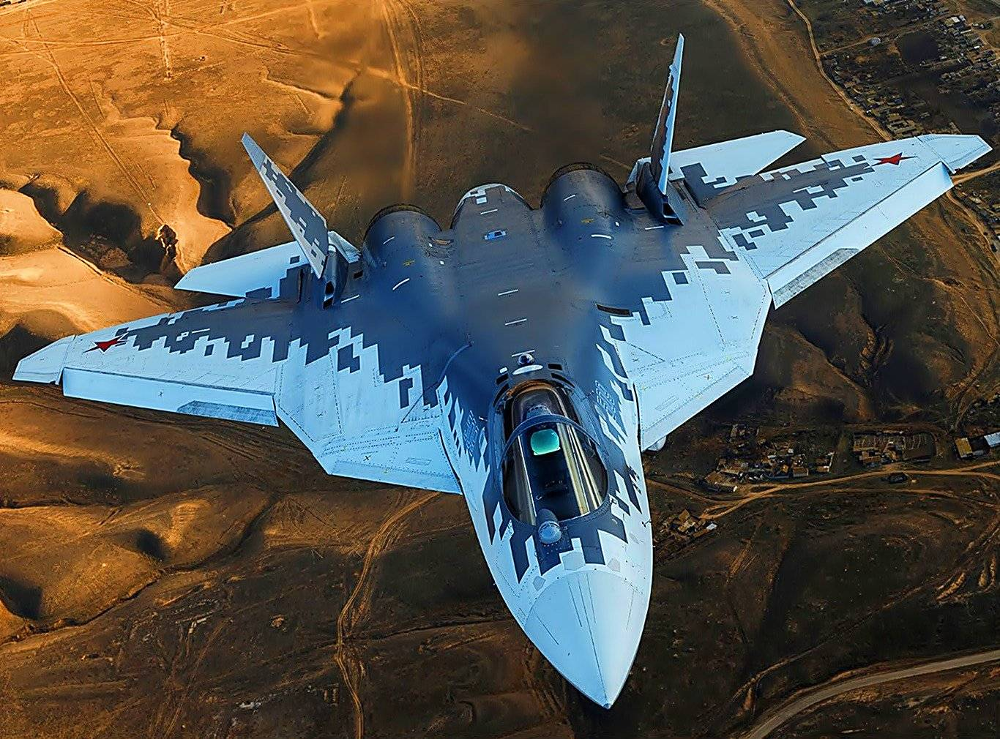# Cockpit- Su-35 Super Flanker+-----------------+----------------------------------------------------------------------------------------------------------------------------------------------------------------------------------------------------------------------------------------------------------------------------------------------------------+
|**First flight** |2010                                                                                                                                                                                                                                                                                                      |
+-----------------+----------------------------------------------------------------------------------------------------------------------------------------------------------------------------------------------------------------------------------------------------------------------------------------------------------+
|**Wingspan**     |14.2 m                                                                                                                                                                                                                                                                                                    |
+-----------------+----------------------------------------------------------------------------------------------------------------------------------------------------------------------------------------------------------------------------------------------------------------------------------------------------------+
|**Length**       |22 m                                                                                                                                                                                                                                                                                                      |
+-----------------+----------------------------------------------------------------------------------------------------------------------------------------------------------------------------------------------------------------------------------------------------------------------------------------------------------+
|**Height**       |6 m                                                                                                                                                                                                                                                                                                       |
+-----------------+----------------------------------------------------------------------------------------------------------------------------------------------------------------------------------------------------------------------------------------------------------------------------------------------------------+
|**Ceiling**      |20 km                                                                                                                                                                                                                                                                                                     |
+-----------------+----------------------------------------------------------------------------------------------------------------------------------------------------------------------------------------------------------------------------------------------------------------------------------------------------------+
|**Range**        |2,400 miles                                                                                                                                                                                                                                                                                               |
+-----------------+----------------------------------------------------------------------------------------------------------------------------------------------------------------------------------------------------------------------------------------------------------------------------------------------------------+
|**Weight**       |37 t                                                                                                                                                                                                                                                                                                      |
+-----------------+----------------------------------------------------------------------------------------------------------------------------------------------------------------------------------------------------------------------------------------------------------------------------------------------------------+
|**Power plant**  |2 x unspecified Saturn engines                                                                                                                                                                                                                                                                            |
+-----------------+----------------------------------------------------------------------------------------------------------------------------------------------------------------------------------------------------------------------------------------------------------------------------------------------------------+
|**Speed**        |2 600 km/h                                                                                                                                                                                                                                                                                                |
+-----------------+----------------------------------------------------------------------------------------------------------------------------------------------------------------------------------------------------------------------------------------------------------------------------------------------------------+
|**Accommodation**|1 crew                                                                                                                                                                                                                                                                                                    |
+-----------------+----------------------------------------------------------------------------------------------------------------------------------------------------------------------------------------------------------------------------------------------------------------------------------------------------------+
|**Armament**     |1 x 30 mm cannon                                                                                                                                                                                                                                                                                          |
|                 |                                                                                                                                                                                                                                                                                                          |
|                 |10 internal and 6 external hardpoints for the R-74M (Western reporting name Archer) and R-77M (Adder) air-to-air missiles, Kh-38M air-to-surface missiles, Kh-31AD and Kh-35U (AS-20 Kayak) anti-ship missiles, Kh-31PD and Kh-58UShK anti-radiation missiles, KAB-250, KAB-500 and KAB-1500 guided bombs.|
+-----------------+----------------------------------------------------------------------------------------------------------------------------------------------------------------------------------------------------------------------------------------------------------------------------------------------------------+ # MiG-35&#x20;The Mikoyan MiG-35 is a Russian multirole fighter that is designed by Mikoyan, a division of the United Aircraft Corporation (UAC). Marketed as a 4++ generation jet fighter, it is a further development of the MiG-29M/M2 and MiG-29K/KUB fighters. According to a Russian defense industry source, the Mikoyan MiG-35 is essentially an upgraded variant of the MiG-29KR. # Cockpit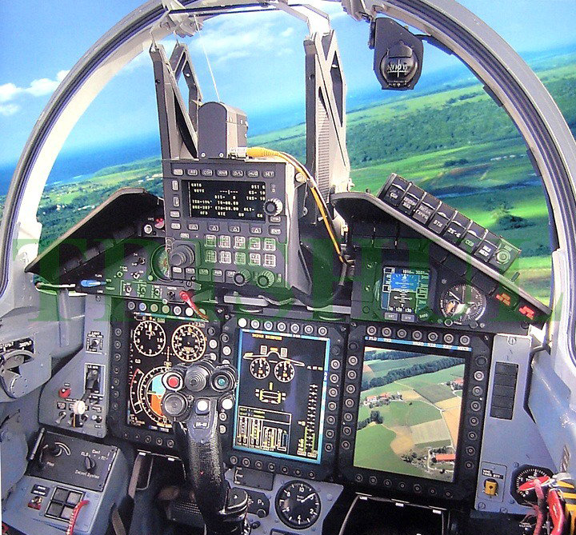* MiG-35 Multi-role fighter| **First flight**  | 2007                                                                                                                                           |
| ----------------- | ---------------------------------------------------------------------------------------------------------------------------------------------- |
| **Wingspan**      | 12 m                                                                                                                                           |
| **Length**        | 17.32 m                                                                                                                                        |
| **Height**        | 4.44 m                                                                                                                                         |
| **Ceiling**       | 17,500 m                                                                                                                                       |
| **Range**         | 2,400 miles                                                                                                                                    |
| **Weight**        | 29,700 kg                                                                                                                                      |
| **Power plant**   | Turbojet dual circuit with afterburner- RD-33MK or its modification with UHT RD-33MKV with all-view thrust vector deviation (within + - 20 °). |
| **Speed**         | 2560 km / h                                                                                                                                    |
| **Accommodation** | 1 or 2 people \[D & UB models]                                                                                                                 |
| **Armament**      | 30 mm aircraft gun GSH-30-1 , all types of guided and unguided air-to-air and air-to-surface munitions                                         | # Mig -29 Fulcrum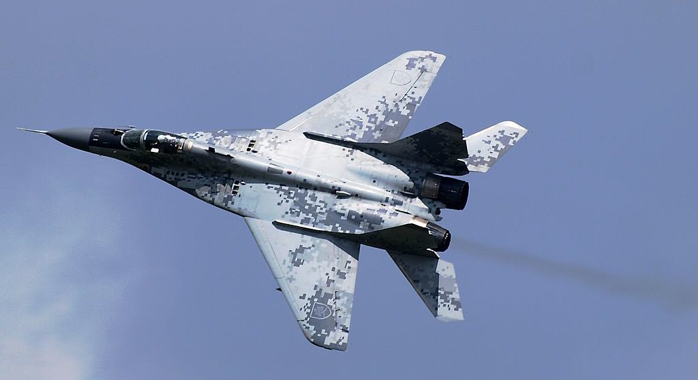 Mig -29 Fulcrum is a twin-engine fighter aircraft designed in the Soviet Union. Developed by the Mikoyan design bureau as an air superiority fighter during the 1970s, the MiG-29, along with the larger Sukhoi Su-27, was developed to counter new U.S. fighters such as the McDonnell Douglas F-15 Eagle and the General Dynamics F-16 Fighting Falcon. The MiG-29 entered service with the Soviet Air Forces in 1983.# Cockpit- Mig -29 Fulcrum+-----------------+------------------------------------------------------------------------------------------------------------------------------------------------+
|**First flight** |1984                                                                                                                                            |
+-----------------+------------------------------------------------------------------------------------------------------------------------------------------------+
|**Wingspan**     |36 feet and 5 inches                                                                                                                            |
+-----------------+------------------------------------------------------------------------------------------------------------------------------------------------+
|**Length**       |56 feet and 10 inches                                                                                                                           |
+-----------------+------------------------------------------------------------------------------------------------------------------------------------------------+
|**Height**       |15 feet and 6.25 inches                                                                                                                         |
+-----------------+------------------------------------------------------------------------------------------------------------------------------------------------+
|**Ceiling**      |18,400 meters                                                                                                                                   |
+-----------------+------------------------------------------------------------------------------------------------------------------------------------------------+
|**Range**        |2,100km                                                                                                                                         |
+-----------------+------------------------------------------------------------------------------------------------------------------------------------------------+
|**Weight**       |68,000 pounds                                                                                                                                   |
+-----------------+------------------------------------------------------------------------------------------------------------------------------------------------+
|**Power plant**  |Two Klimov/Sarkisov RD-33 turbofans                                                                                                             |
+-----------------+------------------------------------------------------------------------------------------------------------------------------------------------+
|**Speed**        |Mach 2.3, 1,520 mph                                                                                                                             |
+-----------------+------------------------------------------------------------------------------------------------------------------------------------------------+
|**Accommodation**|1 crew                                                                                                                                          |
+-----------------+------------------------------------------------------------------------------------------------------------------------------------------------+
|**Armament**     |One 30mm GSh-30L cannon with 150 rounds                                                                                                         |
|                 |                                                                                                                                                |
|                 |Six AAMs including a mix of SARH and                                                                                                            |
|                 |                                                                                                                                                |
|                 |AA- 8 Aphid (R60)                                                                                                                               |
|                 |                                                                                                                                                |
|                 |AA-10 Alamo (R27T)                                                                                                                              |
|                 |                                                                                                                                                |
|                 |AA-11 Archer (R73)                                                                                                                              |
|                 |                                                                                                                                                |
|                 |FAB 500-M62, FAB-1000, TN-100, ECM Pods, S-24                                                                                                   |
|                 |                                                                                                                                                |
|                 |AS-12, AS-14/M Sparrow missiles or AIM-120 advanced medium-range air-to-air missiles; AIM-9L/M Sidewinder or AIM-120 missiles; 20 mm Gatling gun|
+-----------------+------------------------------------------------------------------------------------------------------------------------------------------------+ # Mikoyan MiG-27The Mikoyan MiG-27 is a variable-sweep ground-attack aircraft, originally built by the Mikoyan-Gurevich design bureau in the Soviet Union and later licence-produced in India by Hindustan Aeronautics as the Bahadur. It is based on the Mikoyan-Gurevich MiG-23 fighter aircraft, but optimised for air-to-ground attack.# Cockpit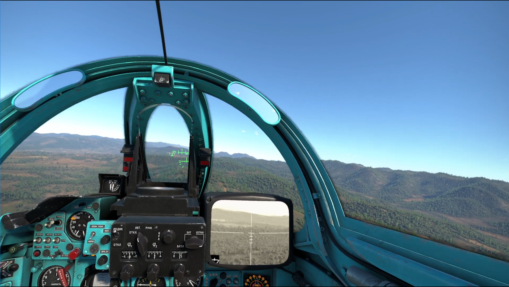
.jpg)- Mikoyan MiG-27+-----------------+----------------------------------------------------------------------------------------------------------------------------------------------+
|**First flight** |1975                                                                                                                                          |
+-----------------+----------------------------------------------------------------------------------------------------------------------------------------------+
|**Wingspan**     |13.97 m spread, 7.78 m swept                                                                                                                  |
+-----------------+----------------------------------------------------------------------------------------------------------------------------------------------+
|**Length**       |17.08 m                                                                                                                                       |
+-----------------+----------------------------------------------------------------------------------------------------------------------------------------------+
|**Height**       |5 m                                                                                                                                           |
+-----------------+----------------------------------------------------------------------------------------------------------------------------------------------+
|**Ceiling**      |14 km                                                                                                                                         |
+-----------------+----------------------------------------------------------------------------------------------------------------------------------------------+
|540 km           |540 km                                                                                                                                        |
+-----------------+----------------------------------------------------------------------------------------------------------------------------------------------+
|**Weight**       |20.6 t                                                                                                                                        |
+-----------------+----------------------------------------------------------------------------------------------------------------------------------------------+
|**Power plant**  |1 x MNPK Soyuz R-29B-300 turbojet                                                                                                             |
+-----------------+----------------------------------------------------------------------------------------------------------------------------------------------+
|**Speed**        |1 885 km/h                                                                                                                                    |
+-----------------+----------------------------------------------------------------------------------------------------------------------------------------------+
|**Accommodation**|1 crew                                                                                                                                        |
+-----------------+----------------------------------------------------------------------------------------------------------------------------------------------+
|**Armament**     |1 x 30 mm six-barrel rotary cannon                                                                                                            |
|                 |                                                                                                                                              |
|                 |Missiles : Kh-23 (AS-7 Kerry), Kh-25ML (AS-10 Karen) and Kg-25MP (AS-12 Kegler) air-to-surface missiles, Kh-28 (AS-9 Kyle) anti-radar missiles|
|                 |                                                                                                                                              |
|                 |Bombs: FAB series free-fall bombs or retarded bombs                                                                                           |
+-----------------+----------------------------------------------------------------------------------------------------------------------------------------------+ # Chengdu  J-20.jpg)The Chengdu J-20, also known as Mighty Dragon is a twinjet all-weather stealth\[12] fighter aircraft developed by China's Chengdu Aerospace Corporation for the People's Liberation Army Air Force (PLAAF). The J-20 is designed as an air superiority fighter with precision strike capability. The aircraft has three variants: the initial production model J-20A, the thrust-vectoring J-20B, and twin-seat aircraft teaming capable J-20S. # Cockpit* Chengdu  J-20 Multirole Stealth Fighter Aircraft| **First flight**  | 2017                                                                                                                                                                          |
| ----------------- | ----------------------------------------------------------------------------------------------------------------------------------------------------------------------------- |
| **Wingspan**      | 14 m                                                                                                                                                                          |
| **Length**        | 23 m                                                                                                                                                                          |
| **Height**        | 6 m                                                                                                                                                                           |
| **Ceiling**       | 66,000 feet                                                                                                                                                                   |
| **Range**         | 4 500 km                                                                                                                                                                      |
| **Weight**        | 34 \~ 36 t                                                                                                                                                                    |
| **Power plant**   | 2 x Xian WS-15                                                                                                                                                                |
| **Speed**         | 2 700 km/h                                                                                                                                                                    |
| **Accommodation** | 1 crew                                                                                                                                                                        |
| **Armament**      | (AAM; PL-12, PL-15 – PL-21) and precision-guided munitions (PGM; LS-6/50, LS-6/100), short-range AAMs (PL-10), long standoff ranges with missiles such as the PL-15 and PL-21 | # &#x20;Shenyang J-16The Shenyang J-16  is a Chinese advanced fourth-generation, tandem-seat, twinjet, multirole strike fighter developed from the Shenyang J-11 (itself derived from the Sukhoi Su-27) and built by Shenyang Aircraft Corporation. It is operated by the People's Liberation Army Air Force (PLAAF).# Cockpit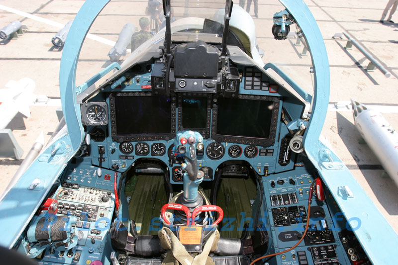- Shenyang J-16+-----------------+-----------------------------------------------------------------------------------------------------------------+
|**First flight** |2012                                                                                                             |
+-----------------+-----------------------------------------------------------------------------------------------------------------+
|**Wingspan**     |14.7 m                                                                                                           |
+-----------------+-----------------------------------------------------------------------------------------------------------------+
|**Length**       |21.9 m                                                                                                           |
+-----------------+-----------------------------------------------------------------------------------------------------------------+
|**Height**       |6.36 m                                                                                                           |
+-----------------+-----------------------------------------------------------------------------------------------------------------+
|**Ceiling**      |20 km                                                                                                            |
+-----------------+-----------------------------------------------------------------------------------------------------------------+
|**Range**        |2,400 miles                                                                                                      |
+-----------------+-----------------------------------------------------------------------------------------------------------------+
|**Weight**       |35 t                                                                                                             |
+-----------------+-----------------------------------------------------------------------------------------------------------------+
|**Power plant**  |2 x WS-10B turbofans                                                                                             |
+-----------------+-----------------------------------------------------------------------------------------------------------------+
|**Speed**        |2 963 km/h                                                                                                       |
+-----------------+-----------------------------------------------------------------------------------------------------------------+
|**Accommodation**|&#x20;2 crew                                                                                                     |
+-----------------+-----------------------------------------------------------------------------------------------------------------+
|**Armament**     |1 x 30 mm cannon (150 rounds)                                                                                    |
|                 |                                                                                                                 |
|                 |Missiles: PL-9, PL-10, PL-12, PL-15 air-to-air missiles, various anti-ship and anti-radiation and cruise missiles|
|                 |                                                                                                                 |
|                 |Bombs: free-fall, laser-guided and satellite-guided bombs                                                        |
|                 |                                                                                                                 |
|                 |Other: Pods with unguided rockets                                                                                |
+-----------------+-----------------------------------------------------------------------------------------------------------------+ # CAC/PAC JF-17 Thunder The CAC/PAC JF-17 Thunder, or FC-1 Xiaolong, is a lightweight, single-engine, multi-role combat aircraft developed jointly by the Chengdu Aircraft Corporation (CAC) of China and the Pakistan Aeronautical Complex (PAC). It was designed to replace the ageing A-5C, F-7P/PG, Mirage III, and Mirage V combat aircraft in the Pakistan Air Force (PAF).The JF-17 can be used for multiple roles, including interception, ground attack, anti-ship, and aerial reconnaissance. The Pakistani designation "JF-17" stands for "Joint Fighter-17", with the "-17" denoting that, in the PAF's vision, it is the successor to the F-16. The Chinese designation "FC-1" stands for "Fighter China-1".# Cockpit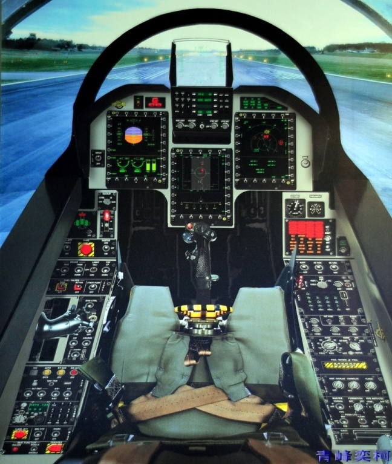- CAC/PAC JF-17 Thunder+-----------------+----------------------------------------------------------------------------------------------------------------------------------------------------------------------------------------------------+
|**First flight** |2003                                                                                                                                                                                                |
+-----------------+----------------------------------------------------------------------------------------------------------------------------------------------------------------------------------------------------+
|**Wingspan**     |9.45 m (31 ft)                                                                                                                                                                                      |
+-----------------+----------------------------------------------------------------------------------------------------------------------------------------------------------------------------------------------------+
|**Length**       |14.93 m (49 ft)                                                                                                                                                                                     |
+-----------------+----------------------------------------------------------------------------------------------------------------------------------------------------------------------------------------------------+
|**Height**       |4.72 m (15 ft 6 in)                                                                                                                                                                                 |
+-----------------+----------------------------------------------------------------------------------------------------------------------------------------------------------------------------------------------------+
|**Ceiling**      |16,920 m (55,500 ft)                                                                                                                                                                                |
+-----------------+----------------------------------------------------------------------------------------------------------------------------------------------------------------------------------------------------+
|**Range**        |1,352 km (840 mi)                                                                                                                                                                                   |
+-----------------+----------------------------------------------------------------------------------------------------------------------------------------------------------------------------------------------------+
|**Weight**       |2,383 kg (27,300 lb)                                                                                                                                                                                |
+-----------------+----------------------------------------------------------------------------------------------------------------------------------------------------------------------------------------------------+
|**Power plant**  |1 × Klimov RD-93                                                                                                                                                                                    |
+-----------------+----------------------------------------------------------------------------------------------------------------------------------------------------------------------------------------------------+
|**Speed**        |Mach 1.6                                                                                                                                                                                            |
+-----------------+----------------------------------------------------------------------------------------------------------------------------------------------------------------------------------------------------+
|**Accommodation**|1 crew                                                                                                                                                                                              |
+-----------------+----------------------------------------------------------------------------------------------------------------------------------------------------------------------------------------------------+
|**Armament**     |Guns: 1× 23 mm GSh-23-2 twin-barrel cannon (can be replaced with 30 mm GSh-30-2)                                                                                                                    |
|                 |                                                                                                                                                                                                    |
|                 |Hardpoints: 7 in total (4× under-wing, 2× wing-tip, 1× under-fuselage; pylon stations number 3, 4 and 5 are wet-plumb capable) with a capacity of 3,629 kg (8,001 lb) for external fuel and ordnance|
|                 |                                                                                                                                                                                                    |
|                 |Missiles: \*\* Air-to-air missiles:                                                                                                                                                                 |
|                 |                                                                                                                                                                                                    |
|                 |MAA-1 Piranha (Short-range)                                                                                                                                                                         |
|                 |                                                                                                                                                                                                    |
|                 |AIM-9L/M (Short-range)                                                                                                                                                                              |
|                 |                                                                                                                                                                                                    |
|                 |PL-5EII (Short-range)                                                                                                                                                                               |
|                 |                                                                                                                                                                                                    |
|                 |PL-9C (Short-range)                                                                                                                                                                                 |
|                 |                                                                                                                                                                                                    |
|                 |PL-12 / SD-10 (Beyond visual range)                                                                                                                                                                 |
|                 |                                                                                                                                                                                                    |
|                 |Air-to-surface missiles:                                                                                                                                                                            |
|                 |                                                                                                                                                                                                    |
|                 |MAR-1 (Anti-radiation missile)                                                                                                                                                                      |
|                 |                                                                                                                                                                                                    |
|                 |C-802A (Anti-ship missiles)                                                                                                                                                                         |
|                 |                                                                                                                                                                                                    |
|                 |C-803 (Anti-ship missiles)                                                                                                                                                                          |
|                 |                                                                                                                                                                                                    |
|                 |CM-400AKG (Anti-ship missiles)                                                                                                                                                                      |
|                 |                                                                                                                                                                                                    |
|                 |Ra'ad ALCM (Nuclear capable Stealth Cruise missile)                                                                                                                                                 |
|                 |                                                                                                                                                                                                    |
|                 |Bombs: \*\* Unguided bombs:                                                                                                                                                                         |
|                 |                                                                                                                                                                                                    |
|                 |Mk-82 (general purpose bomb)                                                                                                                                                                        |
|                 |                                                                                                                                                                                                    |
|                 |Mk-84 (general purpose bomb)                                                                                                                                                                        |
|                 |                                                                                                                                                                                                    |
|                 |Matra Durandal (anti-runway bomb)                                                                                                                                                                   |
|                 |                                                                                                                                                                                                    |
|                 |CBU-100/Mk-20 Rockeye (anti-armour cluster bomb)                                                                                                                                                    |
|                 |                                                                                                                                                                                                    |
|                 |Precision guided munitions (PGM):                                                                                                                                                                   |
|                 |                                                                                                                                                                                                    |
|                 |GBU-10 (Laser-guided)                                                                                                                                                                               |
|                 |                                                                                                                                                                                                    |
|                 |GBU-12 (Laser-guided)                                                                                                                                                                               |
|                 |                                                                                                                                                                                                    |
|                 |LT-2 (Laser-guided)                                                                                                                                                                                 |
|                 |                                                                                                                                                                                                    |
|                 |H-2 (electro-optically guided)                                                                                                                                                                      |
|                 |                                                                                                                                                                                                    |
|                 |H-4 (electro-optically guided)                                                                                                                                                                      |
|                 |                                                                                                                                                                                                    |
|                 |LS-6disambiguation needed (satellite-guided glide bombs)                                                                                                                                            |
|                 |                                                                                                                                                                                                    |
|                 |Satellite-guided bombs                                                                                                                                                                              |
|                 |                                                                                                                                                                                                    |
|                 |Others:                                                                                                                                                                                             |
|                 |                                                                                                                                                                                                    |
|                 |Countermeasures (Flares, Chaff)                                                                                                                                                                     |
|                 |                                                                                                                                                                                                    |
|                 |Up to 3 external drop tanks (2× under-wing 1,100 litres (240 imp gal; 290 US gal), 1× under-fuselage 800 litres (180 imp gal; 210 US gal)) for extended range/loitering time                        |
+-----------------+----------------------------------------------------------------------------------------------------------------------------------------------------------------------------------------------------+ # Mirage 2000The Dassault Mirage 2000 is a French multirole, single-engine, fourth-generation jet fighter manufactured by Dassault Aviation.# Cockpit* Mirage 2000| **First flight**  | July 27, 1972                                                                                                                                                                                                                           |
| ----------------- | --------------------------------------------------------------------------------------------------------------------------------------------------------------------------------------------------------------------------------------- |
| **Wingspan**      | 29 ft, 5 in (9.13 m)                                                                                                                                                                                                                    |
| **Length**        | 50 ft, 3 in (14.36 m)                                                                                                                                                                                                                   |
| **Height**        | 17 ft, 0.75 in (5.20 m)                                                                                                                                                                                                                 |
| **Ceiling**       | Above 50,000 ft / 16,500 m                                                                                                                                                                                                              |
| **Range**         | Combat range over 920 miles (800nm / 1480 km)                                                                                                                                                                                           |
| **Weight**        | 37,478 lb (17,000 kg)                                                                                                                                                                                                                   |
| **Power plant**   | Two 25,000-pound-thrust P\&W F100-PW-100 turbofan engines                                                                                                                                                                               |
| **Speed**         | 1,453 mph (1,262 kt / 2338 km/h)                                                                                                                                                                                                        |
| **Accommodation** | F-15A/C, 1 crew; F-15B/D, 2 crew                                                                                                                                                                                                        |
| **Armament**      | 2 AM.39 Exocet, 1 1300 L drop Tank (855 nm) 1 1300 L drop tank, 2 ARMAT, 2 R.550 Magic (885 nm) 1 1300 L drop tank, 2R.500 Magic, 2 R.530D (885 nm) 4 Belouga, 2 1700 L drop tank, 2 R.550 Magic (1094 nm) 18 EU2 250 kg bombs (756 nm) | # RafaleRafale is a French twin-engine, canard delta wing, multirole fighter aircraft designed and built by Dassault Aviation. Equipped with a wide range of weapons, the Rafale is intended to perform air supremacy, interdiction, aerial reconnaissance, ground support, in-depth strike, anti-ship strike and nuclear deterrence missions. The Rafale is referred to as an "omnirole" aircraft by Dassault.# Cockpit- Rafale+-----------------+----------------------------------------------------------------------------------------------------------------------------------------------------------------------------------+
|**First flight** |2001                                                                                                                                                                              |
+-----------------+----------------------------------------------------------------------------------------------------------------------------------------------------------------------------------+
|**Wingspan**     |10.90 m                                                                                                                                                                           |
+-----------------+----------------------------------------------------------------------------------------------------------------------------------------------------------------------------------+
|**Length**       |15.30 m                                                                                                                                                                           |
+-----------------+----------------------------------------------------------------------------------------------------------------------------------------------------------------------------------+
|**Height**       |5.30 m                                                                                                                                                                            |
+-----------------+----------------------------------------------------------------------------------------------------------------------------------------------------------------------------------+
|**Ceiling**      |50,000 ft                                                                                                                                                                         |
+-----------------+----------------------------------------------------------------------------------------------------------------------------------------------------------------------------------+
|**Range**        |2,400 miles                                                                                                                                                                       |
+-----------------+----------------------------------------------------------------------------------------------------------------------------------------------------------------------------------+
|**Weight**       |24.5 t (54,000 lbs)                                                                                                                                                               |
+-----------------+----------------------------------------------------------------------------------------------------------------------------------------------------------------------------------+
|**Power plant**  |2 x Snecma M88-2 turbofans                                                                                                                                                        |
+-----------------+----------------------------------------------------------------------------------------------------------------------------------------------------------------------------------+
|**Speed**        |M = 1.8 / 750 knots                                                                                                                                                               |
+-----------------+----------------------------------------------------------------------------------------------------------------------------------------------------------------------------------+
|**Accommodation**|F-15A/C, 1 crew; F-15B/D, 2 crew                                                                                                                                                  |
+-----------------+----------------------------------------------------------------------------------------------------------------------------------------------------------------------------------+
|**Armament**     |Gun: 1 x 30 mm (1.2 in) GIAT 30/M791 autocannon with 125 rounds                                                                                                                   |
|                 |                                                                                                                                                                                  |
|                 |Hardpoints:                                                                                                                                                                       |
|                 |                                                                                                                                                                                  |
|                 |14 for Air Force versions (Rafale B/C), 13 for Navy version (Rafale M) with a capacity of 9,500 kg (20,900 lb) external fuel and ordnance and provisions to carry combinations of:|
|                 |                                                                                                                                                                                  |
|                 |                                                                                                                                                                               |
|                 |                                                                                                                                                                                  |
|                 |Air-to-air:                                                                                                                                                                       |
|                 |                                                                                                                                                                                  |
|                 |Magic II                                                                                                                                                                          |
|                 |                                                                                                                                                                                  |
|                 |MBDA MICA IR or EM                                                                                                                                                                |
|                 |                                                                                                                                                                                  |
|                 |MBDA Meteor (planned)                                                                                                                                                             |
|                 |                                                                                                                                                                                  |
|                 |                                                                                                                                                                               |
|                 |                                                                                                                                                                                  |
|                 |Air-to-ground:                                                                                                                                                                    |
|                 |                                                                                                                                                                                  |
|                 |MBDA Apache                                                                                                                                                                       |
|                 |                                                                                                                                                                                  |
|                 |MBDA Storm Shadow/SCALP-EG                                                                                                                                                        |
|                 |                                                                                                                                                                                  |
|                 |AASM-Hammer (SBU-38/54/64)                                                                                                                                                        |
|                 |                                                                                                                                                                                  |
|                 |GBU-12 Paveway II, GBU-22 Paveway III, GBU-24 Paveway III, GBU-49 Enhanced Paveway II                                                                                             |
|                 |                                                                                                                                                                                  |
|                 |AS-30L AGM                                                                                                                                                                        |
|                 |                                                                                                                                                                                  |
|                 |Mark 82 bomb                                                                                                                                                                      |
|                 |                                                                                                                                                                                  |
|                 |                                                                                                                                                                               |
|                 |                                                                                                                                                                                  |
|                 |Air-to-surface:                                                                                                                                                                   |
|                 |                                                                                                                                                                                  |
|                 |MBDA AM 39-Exocet anti-ship missile                                                                                                                                               |
|                 |                                                                                                                                                                                  |
|                 |                                                                                                                                                                               |
|                 |                                                                                                                                                                                  |
|                 |Other:                                                                                                                                                                            |
|                 |                                                                                                                                                                                  |
|                 |Thales Damocles targeting pod                                                                                                                                                     |
|                 |                                                                                                                                                                                  |
|                 |Thales AREOS (Airborne Recce Observation System) reconnaissance pod                                                                                                               |
|                 |                                                                                                                                                                                  |
|                 |Thales TALIOS multi-function targeting pod in the future (F3R Standard)                                                                                                           |
|                 |                                                                                                                                                                                  |
|                 |Up to 5 drop tanks                                                                                                                                                                |
|                 |                                                                                                                                                                                  |
|                 |Buddy-buddy refuelling pod                                                                                                                                                        |
+-----------------+----------------------------------------------------------------------------------------------------------------------------------------------------------------------------------+ # Eurofighter TyphoonThe Typhoon was designed originally as an air-superiority fighter\[5] and is manufactured by a consortium of Airbus, BAE Systems and Leonardo that conducts the majority of the project through a joint holding company, Eurofighter Jagdflugzeug GmbH. The NATO Eurofighter and Tornado Management Agency, representing the UK, Germany, Italy and Spain, manages the project and is the prime customer.# Cockpit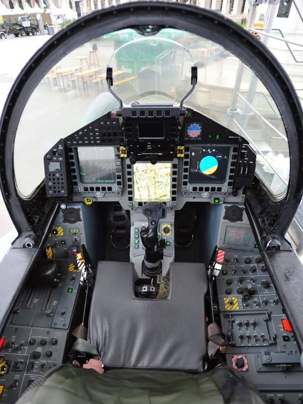- Eurofighter Typhoon+-----------------+----------------------------------------------------------------------------------------------------------------------------------------------------------------------------+
|**First flight** |1986                                                                                                                                                                        |
+-----------------+----------------------------------------------------------------------------------------------------------------------------------------------------------------------------+
|**Wingspan**     |36ft 4½in                                                                                                                                                                   |
+-----------------+----------------------------------------------------------------------------------------------------------------------------------------------------------------------------+
|**Length**       |52ft 4¼in                                                                                                                                                                   |
+-----------------+----------------------------------------------------------------------------------------------------------------------------------------------------------------------------+
|**Height**       |17ft 4¼in                                                                                                                                                                   |
+-----------------+----------------------------------------------------------------------------------------------------------------------------------------------------------------------------+
|**Ceiling**      |55,000 feet                                                                                                                                                                 |
+-----------------+----------------------------------------------------------------------------------------------------------------------------------------------------------------------------+
|**Range**        |1 390 km                                                                                                                                                                    |
+-----------------+----------------------------------------------------------------------------------------------------------------------------------------------------------------------------+
|**Weight**       |23 t                                                                                                                                                                        |
+-----------------+----------------------------------------------------------------------------------------------------------------------------------------------------------------------------+
|**Power plant**  |2 x Eurojet EJ200 turbofans                                                                                                                                                 |
+-----------------+----------------------------------------------------------------------------------------------------------------------------------------------------------------------------+
|**Speed**        |Mach 2.35                                                                                                                                                                   |
+-----------------+----------------------------------------------------------------------------------------------------------------------------------------------------------------------------+
|**Accommodation**|1 crew                                                                                                                                                                      |
+-----------------+----------------------------------------------------------------------------------------------------------------------------------------------------------------------------+
|**Armament**     |1 x 27 mm Mauser BK27                                                                                                                                                       |
|                 |                                                                                                                                                                            |
|                 |Missiles mix of AIM-120B AMRAAM or Meteor FMRAAM, ASRAAM or IRIS-T air-to-air missiles, ALARM anti-radar missiles, Penguin anti-ship missiles, Brimstone anti-armor missiles|
|                 |                                                                                                                                                                            |
|                 |Bombs  Paveway III laser guided bombs                                                                                                                                       |
+-----------------+----------------------------------------------------------------------------------------------------------------------------------------------------------------------------+ # Tornado IDSThe Panavia Tornado is a family of twin-engine, variable-sweep wing multirole combat aircraft, jointly developed and manufactured by Italy, the United Kingdom and West Germany. There are three primary Tornado variants: the Tornado IDS (interdictor/strike) fighter-bomber, the suppression of enemy air defences Tornado ECR (electronic combat/reconnaissance) and the Tornado ADV (air defence variant) interceptor aircraft.# Cockpit* Tornado IDS| **First flight**  | 1974                                                                                                                                                                                                                                                                                                                                                                                                                                                                                                                                                                                                                                                                                                           |
| ----------------- | -------------------------------------------------------------------------------------------------------------------------------------------------------------------------------------------------------------------------------------------------------------------------------------------------------------------------------------------------------------------------------------------------------------------------------------------------------------------------------------------------------------------------------------------------------------------------------------------------------------------------------------------------------------------------------------------------------------- |
| **Wingspan**      | 45.64 ft. / 28 ft, 2 in.                                                                                                                                                                                                                                                                                                                                                                                                                                                                                                                                                                                                                                                                                       |
| **Length**        | 54 ft. 10.25 in.                                                                                                                                                                                                                                                                                                                                                                                                                                                                                                                                                                                                                                                                                               |
| **Height**        | 19 ft. 6.25 in.                                                                                                                                                                                                                                                                                                                                                                                                                                                                                                                                                                                                                                                                                                |
| **Ceiling**       | 50,000 feet                                                                                                                                                                                                                                                                                                                                                                                                                                                                                                                                                                                                                                                                                                    |
| **Range**         | 2,100 nm                                                                                                                                                                                                                                                                                                                                                                                                                                                                                                                                                                                                                                                                                                       |
| **Weight**        | 61,620 lbs                                                                                                                                                                                                                                                                                                                                                                                                                                                                                                                                                                                                                                                                                                     |
| **Power plant**   | 2× Turbo-Union RB199-34R Mk. 101 turbofan at 8,475 lbf or 2× Turbo-Union RB199-34R Mk. 103 turbofan at 8,650 lbf                                                                                                                                                                                                                                                                                                                                                                                                                                                                                                                                                                                               |
| **Speed**         | **Mach 2.2 -** 1313 knots 2,432 Km/h                                                                                                                                                                                                                                                                                                                                                                                                                                                                                                                                                                                                                                                                           |
| **Accommodation** | 2 crew                                                                                                                                                                                                                                                                                                                                                                                                                                                                                                                                                                                                                                                                                                         |
| **Armament**      | 2× 27mm Mauser BK-27 cannon with 180 rounds per cannon Missiles: Air-to-air missiles: AIM-9 Sidewinder or IRIS-T or AIM-132 ASRAAM Air-to-surface missiles: 6× AGM-65 Maverick; or 12× Brimstone missile; or 4× Storm Shadow or Taurus KEPD 350 cruise missile Anti-ship missiles: 2× AS.34 Kormoran; or 2× BAe Sea Eagle Anti-radiation missiles: 4× AGM-88 HARM; or 6× ALARM missile Bombs: Hunting Engineering BL755 cluster bombs; or HOPE/HOSBO GPS/electro-optically guided glide bombs; or Joint Direct Attack Munition; or Paveway series of Laser-guided bomb (LGB); or Up to 2× JP233 or MW-1 munitions dispensers (for runway cratering operations) Up to 4× B61 or WE.177 tactical nuclear weapons | # A-10A-10 Thunderbolt II is a single-seat, twin-turbofan, straight-wing, subsonic attack aircraft developed by Fairchild Republic for the United States Air Force (USAF). In service since 1976, it is named for the Republic P-47 Thunderbolt, a World War II-era fighter-bomber effective at attacking ground targets, but commonly referred to as the "Warthog" or simply "Hog". The A-10 was designed to provide close air support (CAS) to friendly ground troops by attacking armored vehicles, tanks, and other enemy ground forces; it is the only production-built aircraft designed solely for CAS to have served with the U.S. Air Force. Its secondary mission is to direct other aircraft in attacks on ground targets, a role called forward air controller-airborne; aircraft used primarily in this role are designated OA-10.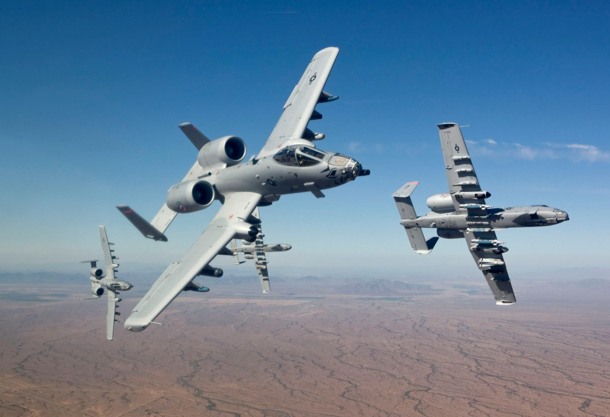# Cockpit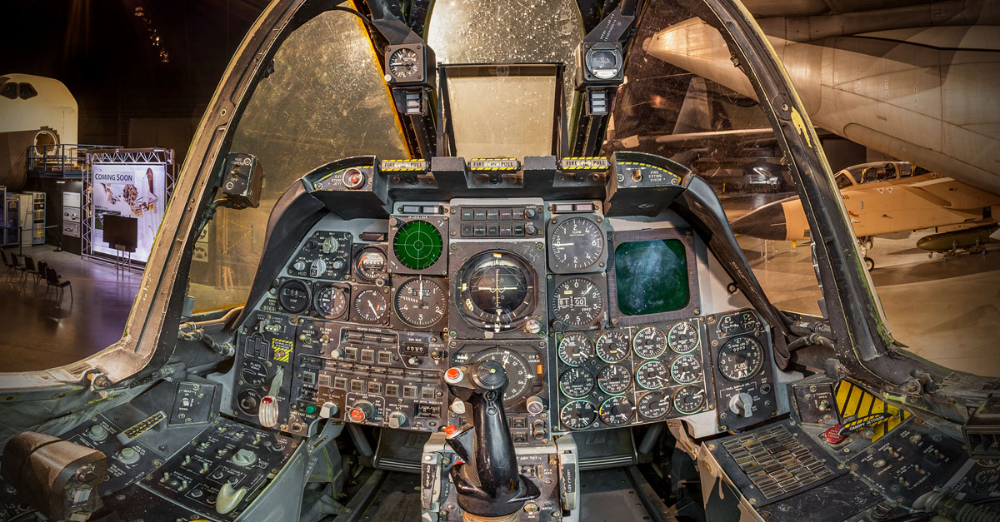* A-10 Thunderbolt| **First flight**  | 1972                                                                                                                                                                                                                                                                                                                                                                                                                                                                                                                                                                                                                                                                                |
| ----------------- | ----------------------------------------------------------------------------------------------------------------------------------------------------------------------------------------------------------------------------------------------------------------------------------------------------------------------------------------------------------------------------------------------------------------------------------------------------------------------------------------------------------------------------------------------------------------------------------------------------------------------------------------------------------------------------------- |
| **Wingspan**      | 57 feet, 6 inches                                                                                                                                                                                                                                                                                                                                                                                                                                                                                                                                                                                                                                                                   |
| **Length**        | 53 feet, 4 inches                                                                                                                                                                                                                                                                                                                                                                                                                                                                                                                                                                                                                                                                   |
| **Height**        | 14 feet, 8 inches                                                                                                                                                                                                                                                                                                                                                                                                                                                                                                                                                                                                                                                                   |
| **Ceiling**       | 45,000 feet                                                                                                                                                                                                                                                                                                                                                                                                                                                                                                                                                                                                                                                                         |
| **Range**         | 2,580 miles                                                                                                                                                                                                                                                                                                                                                                                                                                                                                                                                                                                                                                                                         |
| **Weight**        | 51,000 pounds                                                                                                                                                                                                                                                                                                                                                                                                                                                                                                                                                                                                                                                                       |
| **Power plant**   | Two non-afterburning turbo fan engines, TF34-GE-100, supplied by General Electric                                                                                                                                                                                                                                                                                                                                                                                                                                                                                                                                                                                                   |
| **Speed**         | 700km/h                                                                                                                                                                                                                                                                                                                                                                                                                                                                                                                                                                                                                                                                             |
| **Accommodation** | 1 crew                                                                                                                                                                                                                                                                                                                                                                                                                                                                                                                                                                                                                                                                              |
| **Armament**      | One 30 mm GAU-8/A seven-barrel Gatling gun; up to 16,000 pounds of mixed ordnance on eight under-wing and three under-fuselage pylon stations, including 500 pound Mk-82 and 2,000 pounds Mk-84 series low/high drag bombs, incendiary cluster bombs, combined effects munitions, mine dispensing munitions, AGM-65 Maverick missiles and laser-guided/electro-optically guided bombs; infrared countermeasure flares; electronic countermeasure chaff; jammer pods; 2.75-inch rockets; illumination flares and AIM-9 Sidewinder missiles.IM-7F/M Sparrow missiles or AIM-120 advanced medium-range air-to-air missiles; AIM-9L/M Sidewinder or AIM-120 missiles; 20 mm Gatling gun | # Saab JAS 39 GripenSaab JAS 39 Gripen is a light single-engine multirole fighter aircraft manufactured by the Swedish aerospace and defense company Saab AB. The Gripen has a delta wing and canard configuration with relaxed stability design and fly-by-wire flight controls. Later aircraft are fully NATO interoperable. As of 2020, more than 271 Gripens of all models, A–F, have been built.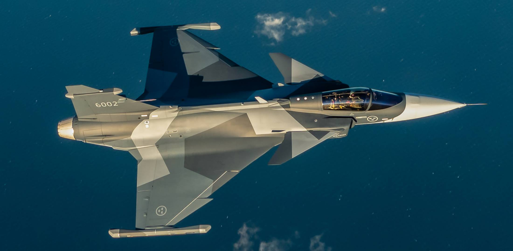# Cockpit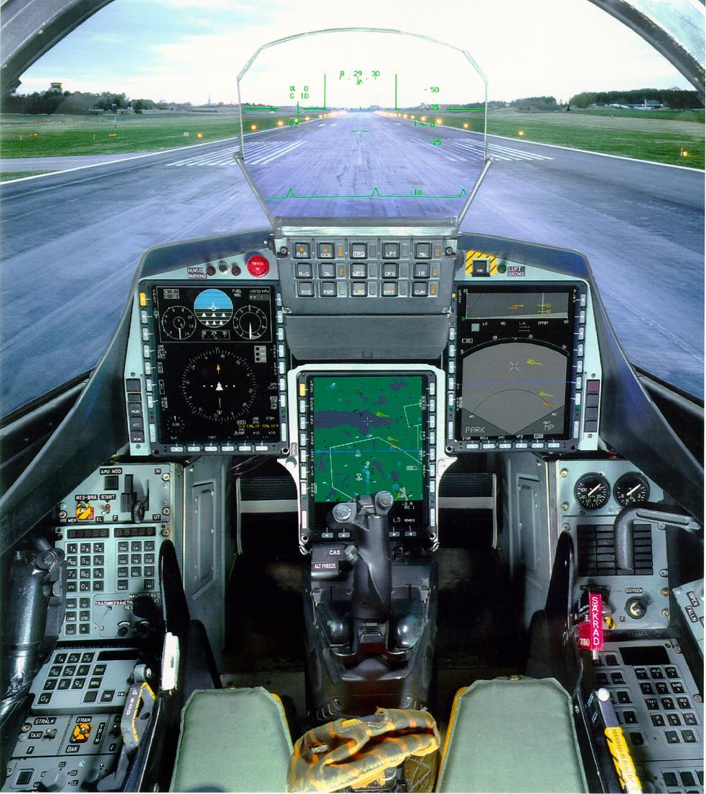
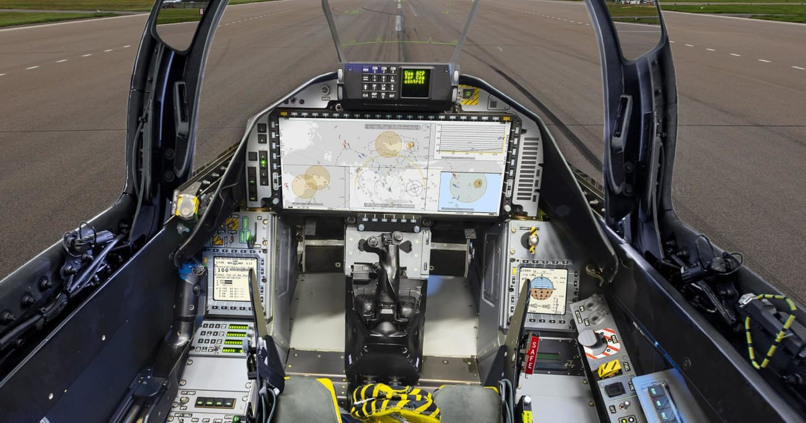- Saab JAS 39 Gripen+-----------------+--------------------------------------------------------------------------------------------------------------------------------------------------+
|**First flight** |1988                                                                                                                                              |
+-----------------+--------------------------------------------------------------------------------------------------------------------------------------------------+
|**Wingspan**     |8.4 m                                                                                                                                             |
+-----------------+--------------------------------------------------------------------------------------------------------------------------------------------------+
|**Length**       |14.9 m                                                                                                                                            |
+-----------------+--------------------------------------------------------------------------------------------------------------------------------------------------+
|**Height**       |4.5 m                                                                                                                                             |
+-----------------+--------------------------------------------------------------------------------------------------------------------------------------------------+
|**Ceiling**      |50,000 feet                                                                                                                                       |
+-----------------+--------------------------------------------------------------------------------------------------------------------------------------------------+
|**Range**        |3,000 km maximum                                                                                                                                  |
+-----------------+--------------------------------------------------------------------------------------------------------------------------------------------------+
|**Weight**       |14,000 kg                                                                                                                                         |
+-----------------+--------------------------------------------------------------------------------------------------------------------------------------------------+
|**Power plant**  |One Volvo Aero RM12 afterburning turbofan                                                                                                         |
+-----------------+--------------------------------------------------------------------------------------------------------------------------------------------------+
|**Speed**        |2,200 km/h                                                                                                                                        |
+-----------------+--------------------------------------------------------------------------------------------------------------------------------------------------+
|**Accommodation**|1 or 2 crew                                                                                                                                       |
+-----------------+--------------------------------------------------------------------------------------------------------------------------------------------------+
|**Armament**     |1 x 27 mm Mauser BK27 cannon                                                                                                                      |
|                 |                                                                                                                                                  |
|                 |Missiles: Rb 74 (AIM-9L), Rb 99 (AIM-120) and IRIS-T air-to-air missiles. Rb-75 (AGM-65 Maverick) air-to-ground missile, Rbs 15F anti-ship missile|
|                 |                                                                                                                                                  |
|                 |Bombs: DWS 39 anti-armor dispenser weapon                                                                                                         |
+-----------------+--------------------------------------------------------------------------------------------------------------------------------------------------+ # AV-8B Harrier IIThe Harrier, informally referred to as the Harrier jump jet, is a family of jet-powered attack aircraft capable of vertical/short takeoff and landing operations.# Cockpit* AV-8B Harrier II| **First flight**  | 1978                                                                                  |
| ----------------- | ------------------------------------------------------------------------------------- |
| **Wingspan**      | 30 feet 4 inches                                                                      |
| **Length**        | 46 feet 4 inches                                                                      |
| **Height**        | 11 feet 8 inches                                                                      |
| **Ceiling**       | 38,000 feet                                                                           |
| **Range**         | 2,416 miles                                                                           |
| **Weight**        | 31,000 pounds                                                                         |
| **Power plant**   | One Rolls Royce 23,400-pound-thrust F402-RR-408 turbofan engine                       |
| **Speed**         | 647 mph                                                                               |
| **Accommodation** | 1 crew                                                                                |
| **Armament**      | Two 25 mm cannons, plus 9,200 pounds of bombs, rockets, missiles or extra fuel tanks. |  # Battlespace Progression Tree For Jet Aircraft&#x20; 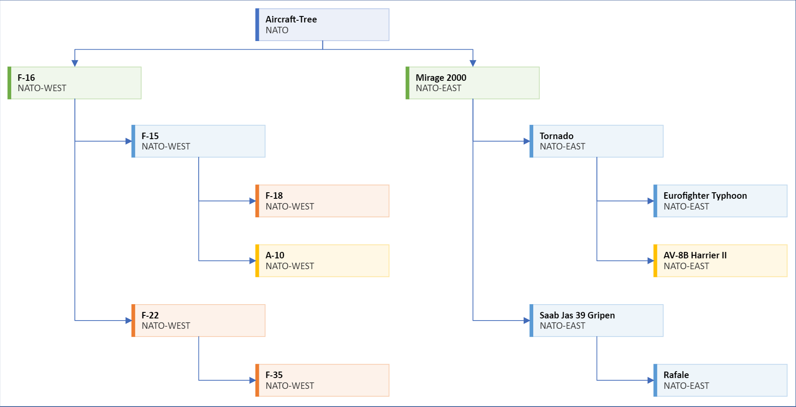[NATO-.xlsx](files/3223c2b5-9c9f-450d-91c5-36d39557746c/NATO-.xlsx)[CSTO.xlsx](files/5218ddb4-1df3-423b-ab16-4b91b3f86459/CSTO.xlsx)   # Air-Dropped Bombs: *Air- Ground  Ordinance:*AASM (France)AN-22 bomb (France)Matra Durandal (France)BLU-107 Durandal (USA)BLU-109 (USA)BLU-116 (USA)GBU-10 Paveway 2000 lbs(USA)GBU-12 Paveway 500 lbs (USA)GBU-15 (USA)EGBU-15 (USA)GBU-24 Paveway III (USA)GBU-28 (USA)Joint Direct Attack Munition (JDAM) (USA)Mark 77 bomb incendiary bomb (USA)Mark 81 bomb (USA)Mark 82 bomb (USA)Mark 83 bomb (USA)Mark 84 bomb (USA)HGK (Hassas Gudum Kiti - Precision Guidance Kit) -(Turkey)KAB-500 (Russia)KAB-500KR (Russia)KAB-500L (Russia)KAB-500S-E (Russia)KAB-1500 (Russia)KAB-1500L (Russia)KAB-1500S-E (Russia)KhAB-250 (Russia)KhAB-500 (Russia)# Air-Launched Missiles*Air- Ground:*AGM-65 Maverick (USAAGM-88 HARM (USA)AGM-114 Hellfire (US)AGM-130 (USA)AGM-122 Sidearm (US) *Air-Air :* AIM-7 Sparrow (USA)AIM-9 Sidewinder (USA)AIM-54 Phoenix (USA)AIM-120 AMRAAM (USA)AIM-132 ASRAAM (UK)Red Dean (UK)Skyflash (UK)Fairey Firestreak (UK)Hawker Siddeley Red Top (UK)Rafael Python series (Israel)Python-3 (Israel)Python-4 (Israel)Python-5 (Israel)IRIS-T (Germany)PARS 3 LR (Germany)MBDA Meteor (Europe)MBDA MICA (Europe)MBDA Magic II (France)R550 Magic (France)Super 530 (France)PL-9 (China)PL-10 (China)PL-12 (China)PL-15 (China)PL-21 (China)Astra BVRAAM (India /Russia)R-73 AA-11 Archer (Russia)Vympel K-13 (Russia)Vympel R-23 (Russia)Vympel R-27 (Russia)Vympel R-33 (Russia)Vympel R-37 (Russia)Vympel R-73 (Russia)Vympel R-77 (Russia)# Air-Launched Rockets*Air- Ground:*Hydra 70 (USA)HVAR rocket (USA)CRV7 (Canada)SNEB 68 mm rocket projectile (France)S-5 rocket (Russia)S-8 rocket (Russia)S-13 rocket (Russia)S-24 rocket (Russia)S-25 rocket (Russia)  # Ai  -  Air Refuling Tankers&#x20; ## KC-10 Extender ## Ilyushin Il-78 ## Y-20 
