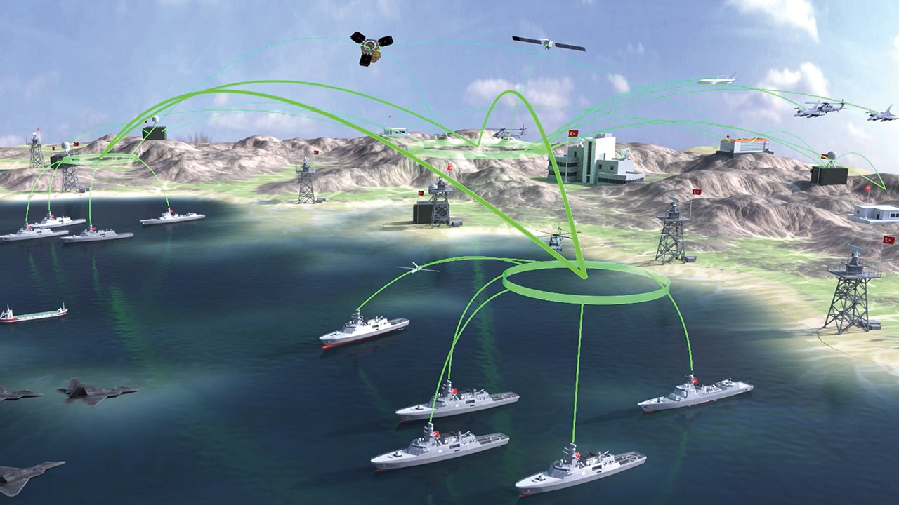

"Battlespace" features a gripping actions that takes players through a series of high-stakes missions across different theatres of operation. The game is set in a current and pass conflicts between Blufor and Opfor, with players taking on the role of different military team members who are tasked with leading their forces to victory.

Naval warfare is combat in and on the sea, the ocean, or any other battlespace involving a major body of water such as a large lake or wide river. Battles have been fought on water for more than 3,000 years. The armed forces branch designated for naval warfare is a navy. Naval tactics and doctrine is the collective name for methods of engaging and defeating an enemy ship or fleet in battle at sea during naval warfare, the naval equivalent of military tactics on land. Naval tactics are distinct from naval strategy.

 

 

When considering maritime warfare, there are two points to bear in mind from the outset. The first is that the object of maritime warfare is ultimately to affect outcomes on the land. The second point is that success in maritime warfare requires the ability to operate at sea, in the air, and on the land. Maritime warfare can best be understood through an appreciation of the strategy it is intended to serve. The benefits of a maritime strategy are not confined to island nations. The ability to use the sea for its own purposes is vital to any nation that relies on maritime trade for its existence and similarly, for those with exposed seaboards, to ensure they cannot be invaded. In fact, any nation that has a desire for security, wealth, and power needs to be able to use the seas freely and assert their right to do so when necessary.

Maritime warfare in relations to Battlespace will be limited in the beginning as solely as platforms to stage beachheads and also the ability to move mass numbers of forces from one  area of the map to another. For overall big picture, Battlespace is definite working on allowing the Navy platform to conduct some kinetic operations that are coupled and coordinated with land forces ie. like sending limited Tomahawk missiles strikes and other capabilities to destroy targets that have been selected by commander.  milk happens Walsall have to maintain a crew to protect these platforms from aerial threats and surface to surface ship missiles.

 

_assigned_to_Amphibious_Craft_Unit_Two_\(ACU-2\),_rehearse_storming_the_beach_in_Curacao,_Netherlands_Antilles.jpg)

 
