---

# Physics 

## Movement Mechanics

*Players,*  will have an options of FPS or 3rd person in most server games that fully mimic the general abilities of human beings to:

1. Walk to Run Adjustable

   Left, Right, Forward, Back, Diagonal
    
2. Sprint

   Left, Right, Forward, Back, Diagonal
    
3. Auto Walk/Run
    
4. Prone:

   Move: Left, Right, Forward, Back, Diagonal

   Roll: Left, Right
    
5. Supine:

   Move: Left, Right, Forward, Back, Diagonal

   Roll: Left or Right into Prone
    
6. Crouch

   Move: Left, Right, Forward, Back, Diagonal
    
7. Vaulting
    
8. Mantling
    
9. Climbing
    
10. Rappelling
     
11. Swimming

 

*Vehicles,* will be first person only that fully mimic the general abilities of driving mechanics for both land and water.&#x20;

 

*Aircraft,* will be first person only that fully mimic the general abilities of flying mechanics. Mechanics will be Air-Realistic mode.&#x20;

 

 

# Capturing Objectives

Each point of interest will have a small group of AI enemy to both sides protection tier area. Players will first ave to neutralize them to start the cap process.  Once the area has been cleared you will need to restore power and communication to the area in order start the collecting resources.&#x20;

 

**Power Grid-**

Power generator will need to be linked to Radio comms and can be destroyed breaking down Radio communication of a team in the area. Power generators will also be used to power other important assets like Re-Spawn system of an area that has been taken or captured. These in-game mechanical components enforce players to work together, communicate and encourages some level of pre-planning.

**Power Generator**: will have Array set to distance to check for equipment that can be linked together, with a check (if) distance is > than x, will run

(If) distance is \< than x, will not run

Distance is Sphere x,y,z this allows for height on mountains or hill to play a factor with range.

 

 

# Communication&#x20;

**Radios** - Comms to be used with Mesh Mobile Systems.

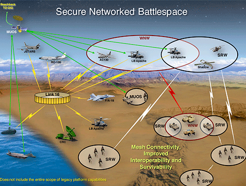

Local Comms Radio works with *Short Range Radio*. In order to have long range radio comms on the map a network of mobile radio system, that have a different range value must be set up and linked together for the entire team to communicate with all assets. Links can be broken, and short range can still be used to achieve the mission.

# Satellite

**Satellite***:* has the ability to link all communications across the map. This is progress function that will allow you to link everyone together all comms across the map. Time or progress of captured areas will unlock this for the your team. &#x20;

 

 

**Radios**: will have Array set to distance to check for equipment that can be linked together, with a check (if) distance is > than x, signal works

(If) distance is \< than x, signal derogates

Distance is Sphere x,y,z this allows for height on mountains or hill to play a factor with range.

 

**Aircraft**- will have their own comms directly to Squad Leaders and Commander. Special Radios will need to be used.

 

 

 

# Construction Function  🚧&#x20;

 

&#x20;All Construction must have a power grid hooked up. This allows the Commander to build a list of  constructable that will help win the battle, ie..  fortifications and defenses objects ect.. .

 

**Forward Operating Base (FOB) -** Static harden spawns' point.

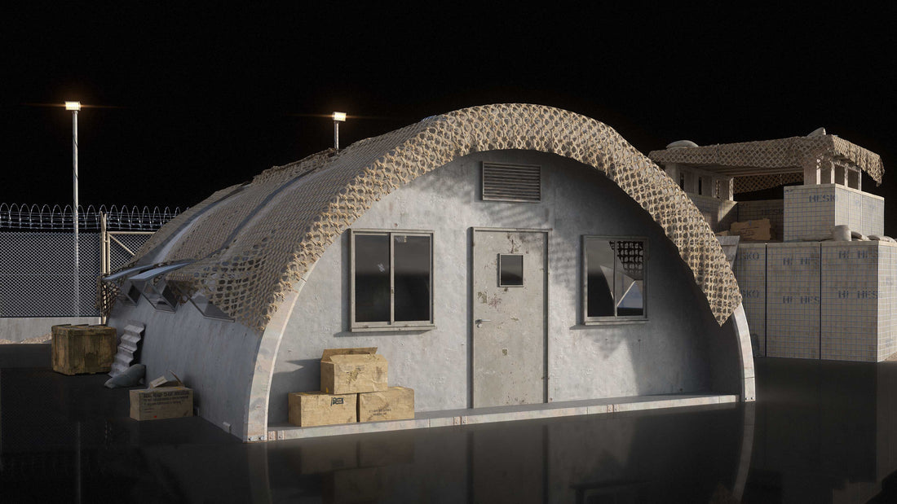

 

**Salvage Vehicle** - is used to salvage destroy vehicles. Player will need drive to the destroy vehicle and select the function key to "Salvage Vic". For each vehichle salvaged, resources will be added to the Motor Pool Economy for your team.&#x20;

Two ways to Salvage:

1. &#x20;If the vehicle is scrapped in the field (x) amount will be at the the motor pool.&#x20;
2. If the destroy vehicle towed by a Salvage Vehicle and driven back to the main Motor Pool, (2 x's) the amount of resources will be added to the team or an extra vehicle asset that is equivalent to the salvage will be added the team assets reserve.&#x20;
    

.jpeg>)

 

**Repair Vehicle -** is mobile repair vehicle that can speed up the repair time. Vehicle must not be totally destroyed. &#x20;

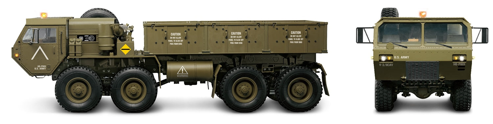

 

**Armory** - a military storage compound where machine guns, rifles, pistols, ammunition, parts, explosives and accessories are kept. **Armory** - loadout menu will be accessed from here for players to buys and build thier kits.

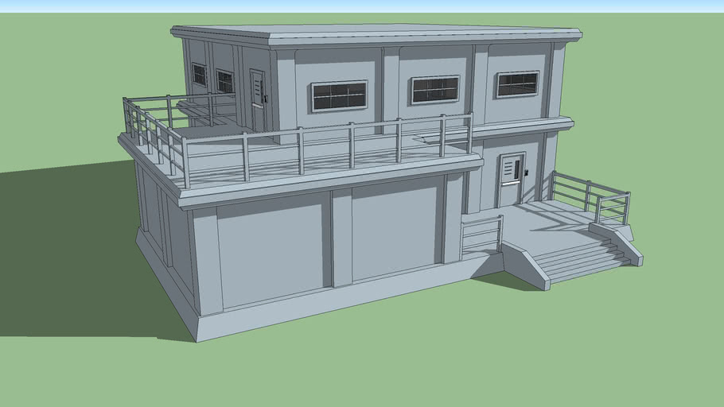

 

**Research Facilities** -research laboratory focused on cutting-edge scientific discovery, technological innovation, and transition of knowledge products that offer incredible potential to improve the military’s chances of surviving and winning any future conflicts. This will be where upgrades of equpment, vehicles and Aircraft is done. This controls the advancement of technology on the battlefield. Once goal and resources have been achieved it will unlock the tech allowing the players to build better vehicles or aircraft  and use better equipment.&#x20;

 

**Communications Center** -The nerve center or war room is primarily a communications facility where audio, video and digital communication is relayed and analyzed by military staffers who evaluate and correlate various pieces of information to discern the level at which a concern should be elevated.

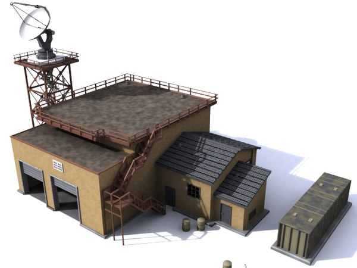

 

**HQ -** The military installation from which a commander performs the functions of command.

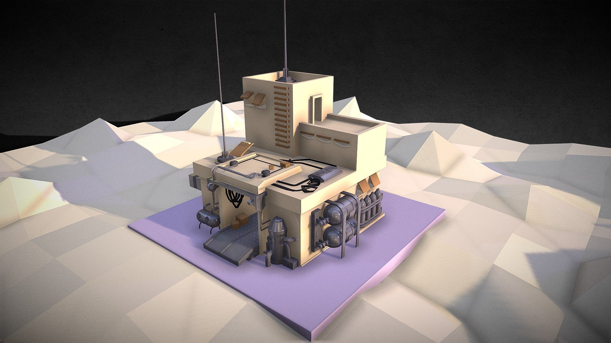

 

**Hanger** - Storage for air asset assigned to each squad.  Captured vehicles can be salvage or recovered back to the main base to be repaired and reused or cashed out as resources for building different vehicles.  Aircraft can be built there for usage.&#x20;

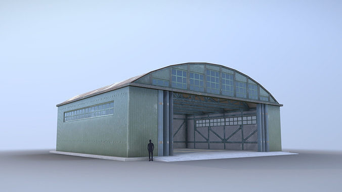

 

**Motor Pool** - Function that is storage for vehicles asset assigned to each squad.  Captured vehicles can be salvage or recovered back to the main base to be repaired and reused or cashed out as resources for building different vehicles.  Vehicles can be built there for usage.&#x20;

 

**Main Power Station** - The most robust and reliable power solutions for defense or offensive needs. It allow the start of the network for the power to be set up to each area captured.  This powers your FOB Spawn point and other equipment that requires power grid.&#x20;

Fuel Truck - Mobile refuel truck.&#x20;

 

**Rally Spawn Point (RSP)** - Mobile spawn point that can be trip if enemy is near.&#x20;

 

Drones : IRS in the sky. An unmanned combat aerial vehicle (UCAV), also known as a combat drone, colloquially shortened as drone or battlefield UAV, is an unmanned aerial vehicle (UAV) that is used for intelligence, surveillance, target acquisition, and reconnaissance and carries aircraft ordnance such as missiles, ATGMs, and/or bombs in hardpoints for drone strikes.

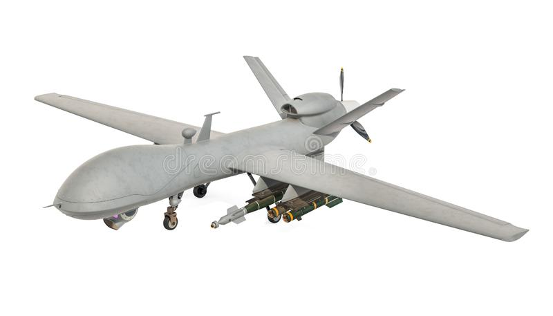

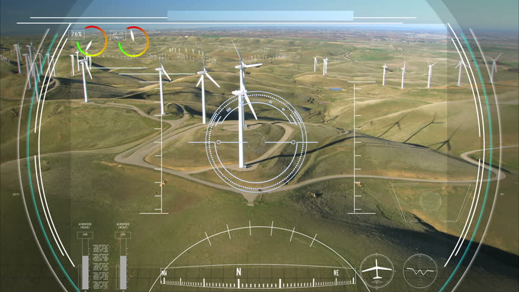

&#x20;

Medium Tactical Vehicle Replacement MTVR (Supplies):  The MTVR can carry a payload of seven tons or up to fifteen tons driving on smoother surfaces, while simultaneously being able to tow an eleven ton load. The MTVR is highly adaptable for any cargo hauling, carrying or winching. It's wide versatility makes the MTVR an integral part of the  logistical backbone. This vehicle is the prime mover for the M777 howitzer, troops, fuel, water and a wide variety of other equipment.

 

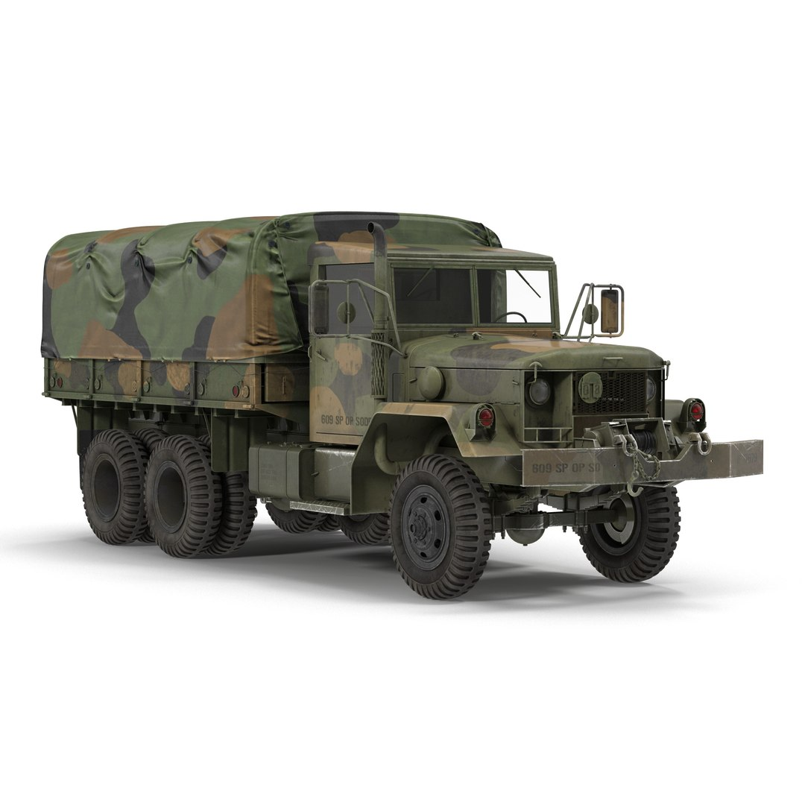
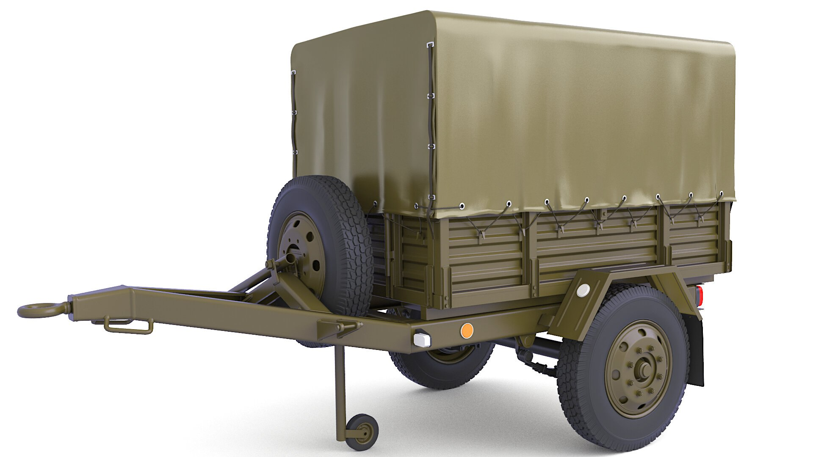

---

#

 

 

 

 

 

 

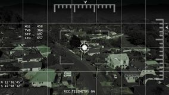

 

 

### Combat

1. Electronic Warfare (EW) Jamming - Function it can be used to deny adversaries the ability to either disrupt or use these signals.  Radios will be blocked 120 seconds over a selected area and 10 min cool down time.&#x20;

# Movement&#x20;

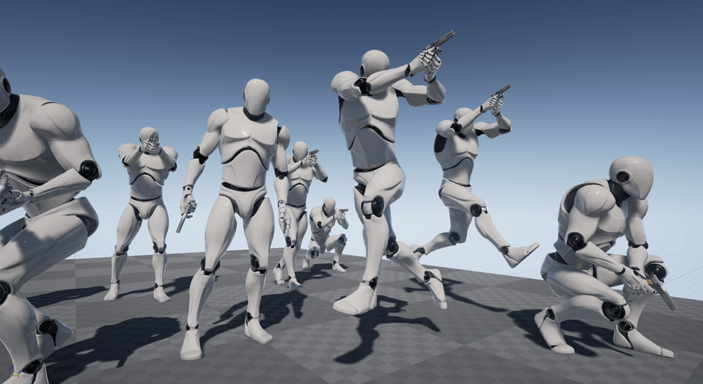

 

 

1. Walk to Run Adjustable

   Left, Right, Forward, Back, Diagonal
    
2. Sprint

   Left, Right, Forward, Back, Diagonal
    
3. Auto Walk/Run
    
4. Prone:

   Move: Left, Right, Forward, Back, Diagonal

   Roll: Left, Right
    
5. Supine:

   Move: Left, Right, Forward, Back, Diagonal

   Roll: Left or Right into Prone
    
6. Crouch

   Move: Left, Right, Forward, Back, Diagonal
    
7. Vaulting
    
8. Mantling
    
9. Climbing
    
10. Rappelling
     
11. Swimming

 

1. F key is the function key, each object will have it own sub-function.&#x20;
2. Q key leans left
3. E key leans right&#x20;
4. X key goes prone
5. C key crouch&#x20;
6. Left Alt Key local Radio&#x20;
7. W key forward&#x20;
8. S key is back&#x20;
9. &#x20;A key is strafe left
10. &#x20;D key is strafe right
11. &#x20;R key reloads
12. &#x20;T key works lights or lazes attachments off or on&#x20;
13. &#x20;Enter Key on number pad is toggle 1st person to 3rd person view

 

# Dynamic Spawn Points & Objective Generator &#x20;

 

&#x20;Our Dynamic Spawn Points and Objective Generator injects new life into gameplay by removing the ability to exploit the game through prior knowledge of level design. This guarantees a unique experience with every match, keeping the map fresh and allowing players to fully appreciate the thought and detail put into each area of the map by the designers. Elevate your gameplay to the next level with our innovative system.

 

 

# Mapping

 

Transparent Topographical

 

# In Game Comms

Game will have built in VOIP for both local and team that will be tied in with Radio assets to give another layer of immersion. Normal type chat will be allowed for team and all.&#x20;

 

 

# Elements

 

## Interfaces Design Patterns&#x20;

 

### Badges -&#x20;

 

**Leaderboard -**

 

Levels -&#x20;

 

# Interfaces Design Patterns &#x20;

 

Time constraints -&#x20;

 

Limited Asset Resources -&#x20;

 

Objective Constraints -

 

Resources Systems -&#x20;

 

 

 

 

\
