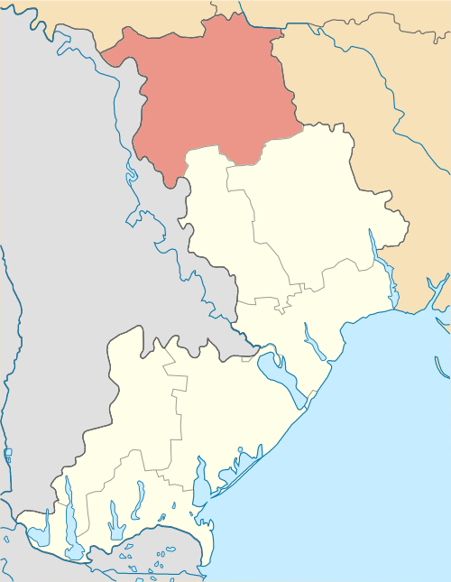

# General description

Podilsk, until May 2016 Kotovsk, is a city in Odesa Oblast, southern Ukraine.

Area: 15.90 km2 ,  9.822 mi²

Elevation: 840′

# Levels that use this area

...

# Connections to other areas

...
