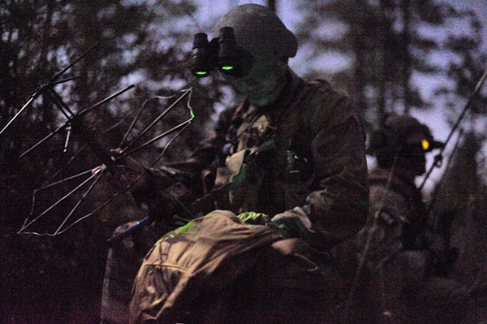

# Character Description

This player will need to stay close with the Team Leaders, Squad Leaders and/ or Commanders to use radio for higher ups or air assets. Some vehicles will have the same function allowing Team Leaders, Squad Leaders and/ or Commanders to use the function without a radio man class nearby.

.jpeg>)

# Appearance

#

# Special abilities

Able to call in AI air-assets or manned aircraft assets for close air support, supply drops, and re-enforcements transports when in range of the commander.&#x20;

# Disadvantages:

Player has to be able to stay alive and keep close tabs on the Team Leaders, Squad Leaders and/ or Commanders, while still being able to fight to the objective.
