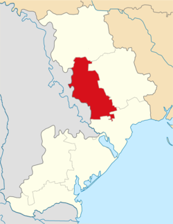

# General description

Rozdilna is a small city in Odesa Oblast (province) of southern Ukraine.

Area: 7.544 km2&#x20;

Elevation: 492′

# Levels that use this area

...

# Connections to other areas

...
