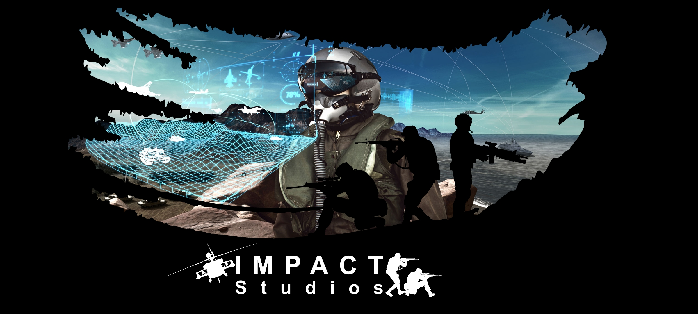

Founder and CEO Impact Studios - Medina, OH February 2021 to Present Capabilities Animation, Rigging, Modeling, illustration, Ui-UX, Technical art, visual scripting (Kermit, Blueprinting), C# C C++, python, SQL, Javascript, CSS, HTML, and HTML5. We push for Entertainment from cinematics, Game Development, Web Design, an Application Development.

Computer Tech Astro Computers - Medina, OH January 2023 to Present

Mechanical knowledge — Proficient August 2019 Measures a candidate's ability to understand and apply mechanical concepts and processes. Full results: Proficient Analyzing data — Proficient January 2022 Interpreting and producing graphs, identifying trends, and drawing justifiable conclusions from data Full results:&#x20;

Proficient Software developer skills — Familiar

January 2022 Designed by engineering managers and real-world employers, this test gives you hard data points to evaluate technical competency Full results: Familiar Indeed Assessments provides skills tests that are not indicative of a license or certification, or continued development in any professional field.

 

Publications:

Steel Division

&#x20;<https://steamcommunity.com/sharedfiles/filedetails/?id=2432926361> March 2021 Squad Conversion&#x20;

Mod Shadows Of Soldiers&#x20;

<https://www.shadowsofsoldiers.com> August 2021 Third Person - First Person Meta Shooter  The game is composed of Visual scripting Entirely by myself.
